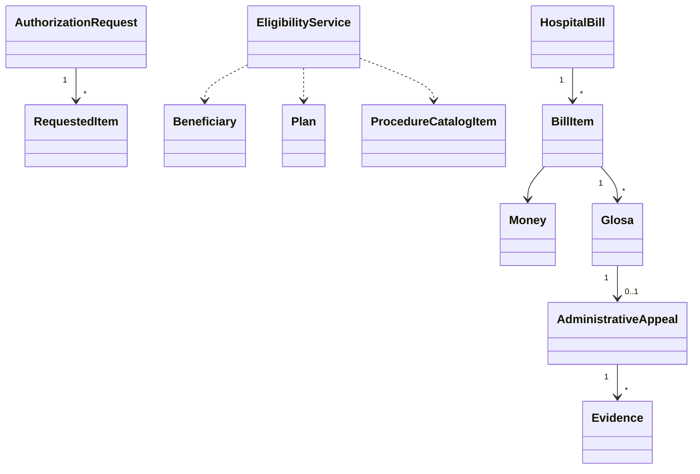

**DOCUMENTAÇÃO TÉCNICA**

**MODELAGEM DDD PARA SISTEMA DE OPERADORA DE SAÚDE**

Consolidação de decisões de modelagem, entidades, agregados, módulos, serviços, repositórios e regras de negócio

**Alunos:**
Mateus Souza Araujo, Victor Hugo Brito Coelho e José Emanuel Andrade Dourado

**Professor:**
Neuton Melo

# **INTRODUÇÃO**

Este documento reúne, em uma única estrutura, a modelagem DDD do código atual do projeto `DDD-Case-1`, preservando as informações relativas a contexto do domínio, decisões de modelagem, Entities, Value Objects, Aggregates, regras de consistência, módulos, factories, services, repositories e regras de negócio.

A versão atual do código está organizada como uma solução .NET com os projetos `Domain`, `Application`, `Infra`, `UI` e `Tests`. O recorte implementado é um **DDD tático v1**, focado em autorização de procedimento, elegibilidade, faturamento hospitalar básico, glosas e regras iniciais de recurso administrativo. A infraestrutura atual usa SQLite por meio de `Microsoft.Data.Sqlite`; portanto, este documento não considera mais a versão antiga baseada em repository em memória.

Além da consolidação textual, foi mantido o diagrama do domínio fornecido, com apresentação e formatação compatíveis com padrões acadêmicos baseados na ABNT.

***Link GitHub:***
*https://github.com/victorhugobc7/DDD-Case-1.git*

# **DIAGRAMA DO DOMÍNIO**

A Figura 1 preserva o diagrama do domínio fornecido originalmente, destacando entidades, value objects, serviços de domínio, fábricas e relacionamentos principais entre os elementos modelados. O texto deste documento, porém, foi atualizado para refletir a versão atual do código.

Na implementação atual, a estrutura principal é:

```text
Domain
  Authorizations: AuthorizationRequest, RequestedItem, EligibilityService, AuthorizationRequestFactory, IAuthorizationRepository
  Beneficiaries: Beneficiary, BeneficiaryStatus, IBeneficiaryRepository
  Plans: Plan, PlanNumber, PlanType, IPlanRepository
  Procedures: ProcedureCatalogItem, ProcedureCode, CidCode, ProcedureType, IProcedureCatalogRepository
  Billing: HospitalBill, BillItem, Money, HospitalBillStatus, IHospitalBillRepository
  Audit: Glosa, AdministrativeAppeal, Evidence, GlosaReason, AppealStatus
  ProviderNetwork: ProfessionalRegistry

Application
  DTOs
  Interfaces
  Services
  UseCases/Authorizations
  UseCases/Billing

Infra
  Data: HealthInsuranceDatabase
  Repositories: AuthorizationRepository, HospitalBillRepository, BeneficiaryRepository, PlanRepository, ProcedureCatalogRepository
```

![][image1]
Figura 1 – Diagrama de classes e relacionamentos do domínio

## **Diagrama executável atual**

O diagrama abaixo representa apenas o código executável atual do recorte v1. Ideias futuras de integração regulatória, ANS ou TISS não fazem parte deste diagrama.



# **DECISÕES DE MODELAGEM**

## **1\. Contexto do domínio**

O projeto modela parte de um sistema de operadora de saúde. O recorte implementado concentra-se nos fluxos de autorização de procedimento, elegibilidade do beneficiário, faturamento hospitalar, glosas e recursos administrativos.
Esse recorte foi tratado como domínio rico porque possui regras próprias: autorização pode ser integral, parcial ou negada; atendimentos de urgência seguem exceção operacional; elegibilidade depende de plano, beneficiário e procedimento; glosas podem gerar recurso; e algumas decisões precisam preservar histórico e justificativa.

## **2\. Critérios usados na modelagem**

### **Entities**

Um conceito foi modelado como Entity quando possui identidade própria, ciclo de vida ou mudanças relevantes ao longo do tempo. Por isso, elementos como AuthorizationRequest, Beneficiary, Plan, HospitalBill, BillItem, Glosa e AdministrativeAppeal possuem identidade e comportamento.
Mesmo quando uma classe é filha de outra dentro de um Aggregate, ela continua sendo Entity se precisa ser distinguida individualmente. Esse é o caso de RequestedItem, BillItem, Glosa e AdministrativeAppeal.

### **Value Objects**

Um conceito foi modelado como Value Object quando seu valor é mais importante que uma identidade própria. PlanNumber, ProcedureCode, CidCode, ProfessionalRegistry e Evidence existem para expressar dados do domínio com validação e significado, sem ciclo de vida independente.
Essa decisão evita o uso excessivo de string no domínio e centraliza validações importantes, como o formato do CID em CidCode.

### **Aggregates**

Os Aggregates foram definidos a partir das regras que precisam ser consistentes dentro de uma mesma transação de domínio.
Exemplo: uma autorização e seus itens precisam mudar de estado juntos. Quando uma autorização é aprovada integralmente, todos os itens devem refletir a aprovação. Quando é negada, todos os itens devem ser negados. Por isso, AuthorizationRequest é Aggregate Root e controla RequestedItem.

### **Domain Services**

Foi criado um Domain Service quando a regra de negócio não pertencia naturalmente a uma única Entity ou Aggregate. A elegibilidade depende de Beneficiary, Plan e ProcedureCatalogItem; colocar essa regra em apenas uma dessas classes geraria acoplamento artificial. Por isso, a regra ficou em EligibilityService.

### **Factories**

Foi criada uma Factory quando a criação de um objeto envolvia mais do que chamar um construtor simples. Na versão atual, AuthorizationRequestFactory gera o identificador da autorização, constrói a AuthorizationRequest e aplica a regra especial de urgência/emergência.

Na versão atual do código, existe uma divisão importante: `RequestAuthorizationUseCase` cria os Value Objects e os `RequestedItem` a partir do DTO, enquanto `AuthorizationRequestFactory` recebe esses objetos já montados, gera o identificador da autorização e aplica a regra especial de urgência/emergência.

### **Repositories**

Repositories foram definidos para Aggregate Roots que precisam ser persistidas ou consultadas como unidades completas. O domínio declara as interfaces e a infraestrutura fornece implementação, preservando o isolamento do domínio.

## **3\. Decisões relevantes**

### **AuthorizationRequest guarda referências por valor ou identificador**

AuthorizationRequest referencia o beneficiário por BeneficiaryId e o plano por PlanNumber, em vez de carregar objetos completos de Beneficiary e Plan.
Essa escolha reduz o acoplamento entre Aggregates. A autorização protege apenas as regras internas da própria solicitação. Regras que exigem leitura de beneficiários, planos e procedimentos são resolvidas por EligibilityService.

### **RequestedItem é filho de AuthorizationRequest**

RequestedItem não foi modelado como Aggregate Root porque não faz sentido aprovar, negar ou persistir um item isolado fora da solicitação. Ele existe para detalhar a solicitação e deve seguir o ciclo de vida da autorização.

### **HospitalBill concentra faturamento e glosas**

HospitalBill representa a conta hospitalar como unidade principal de faturamento. Seus BillItem podem receber Glosa, e uma Glosa pode receber um AdministrativeAppeal.
Essa cadeia fica próxima no modelo porque as regras de glosa e recurso são consequência direta da cobrança apresentada. Na persistência atual, HospitalBillRepository salva HospitalBill, BillItem, Glosa, AdministrativeAppeal e Evidence, mantendo glosas e recursos dentro do limite transacional da conta hospitalar.

### **Elegibilidade é validada antes da criação da autorização**

A autorização não decide sozinha se o beneficiário está ativo, se pertence ao plano, se cumpriu carência ou se possui idade permitida. Essas regras cruzam três conceitos: beneficiário, plano e procedimento. Por isso foram colocadas em EligibilityService e são chamadas por `RequestAuthorizationUseCase` antes da criação da autorização.

### **Application Service não concentra regra de domínio**

AuthorizationService, no projeto Application, coordena casos de uso por meio de classes específicas em `Application/UseCases`. Os use cases recebem DTO ou id, chamam Factory quando necessário, carregam Aggregate pelo Repository, executam método de domínio e salvam o resultado. Eles não contêm as regras principais de aprovação, negativa, pendência ou urgência.
Isso mantém o domínio isolado e facilita testar as regras sem depender de infraestrutura.

## **4\. Trade-offs assumidos**

| Decisão | Benefício | Custo ou limitação |
| :---- | :---- | :---- |
| Usar Guid como identidade principal | Simples, único e independente de banco de dados | Não expressa números de negócio como protocolo ou lote  |
| Representar plano na autorização por PlanNumber | Evita carregar Aggregate de plano dentro da autorização | A consistência entre plano e beneficiário depende do serviço de elegibilidade |
| Criar  EligibilityService | Regra fica explícita e sem acoplamento artificial | Exige orquestração externa para fornecer beneficiário, plano e procedimento |
| Repository em SQLite | Permite demonstrar persistência real local e recarregamento de aggregates | Ainda é uma persistência simples, sem migrations formais |
| Separar DTOs no Application | Evita vazar entidades de domínio para entrada e saída da aplicação | Exige mapeamento entre DTO e domínio  |

## **5\. Isolamento do domínio**

O projeto Domain não depende de Application, Infra ou UI. Essa é uma decisão central: regras de negócio devem permanecer independentes de banco de dados, console, APIs ou mecanismos externos.
As dependências seguem o sentido esperado:

```text
UI -> Application -> Domain
UI -> Infra -> Domain
Application -> Domain
Infra -> Domain
Tests -> Application, Domain e Infra
```

O domínio define contratos como IAuthorizationRepository e IHospitalBillRepository; a infraestrutura implementa esses contratos.

**ENTITIES E VALUE OBJECTS**

## **1\. Entities**

Entities foram escolhidas para conceitos que possuem identidade, comportamento e ciclo de vida. A identidade permite reconhecer o mesmo objeto mesmo quando seus atributos mudam.

| Conceito | Classe | Identidade | Por que é Entity | Responsabilidade principal |
| :---- | :---- | :---- | :---- | :---- |
| Solicitação de autorização | AuthorizationRequest | Id | Possui ciclo de vida próprio: pendente, aprovada, aprovada parcialmente ou negada. | Controlar decisão de autorização, itens solicitados, justificativas, pendência documental e exceção de urgência. |
| Item solicitado | RequestedItem | Id | Cada item pode ter quantidade aprovada diferente dentro da autorização. | Representar material, medicamento ou item pedido e sua quantidade aprovada. |
| Beneficiário | Beneficiary | Id | Representa uma pessoa vinculada a um plano, com status e histórico de adesão. | Controlar dados essenciais, status e vínculo com o plano. |
| Plano | Plan | Id | Representa um produto/contrato de cobertura com regras próprias. | Definir tipo de plano, coparticipação e carências por tipo de procedimento. |
| Procedimento do catálogo | ProcedureCatalogItem | ProcedureCode | Representa item de referência do catálogo, identificado pelo código do procedimento. | Definir descrição, tipo e restrições de idade do procedimento. |
| Conta hospitalar | HospitalBill | Id | Possui ciclo próprio de cobrança e reúne itens faturados. | Agrupar itens cobrados por beneficiário e estabelecimento executante. |
| Item da conta | BillItem | Id | Cada cobrança possui quantidade, valor e glosas próprias. | Representar cobrança vinculada a uma autorização aprovada. |
| Glosa | Glosa | Id | É uma negativa/desconto individual, com motivo, justificativa e possível recurso. | Registrar motivo de glosa, indicar se é estorno por auditoria e controlar recurso. |
| Recurso administrativo | AdministrativeAppeal | Id | Possui status próprio de análise, manutenção ou reversão da glosa. | Controlar evidências e decisão sobre contestação de uma glosa. |

### **Observação sobre entidades filhas**

Nem toda Entity é Aggregate Root. RequestedItem, BillItem e AdministrativeAppeal possuem identidade, mas não devem ser manipuladas diretamente como unidades independentes de persistência. Glosa possui comportamento próprio de auditoria e recurso, mas no código atual ainda nasce e é persistida pelo fluxo de BillItem/HospitalBill, sem repository próprio.

## **2\. Value Objects**

Value Objects foram usados para conceitos que não precisam de identidade própria e são definidos pelo valor que carregam.

| Conceito | Classe | Por que é Value Object | Validação ou significado |
| :---- | :---- | :---- | :---- |
| Número do plano | PlanNumber | O valor identifica o plano no contexto da solicitação, sem ciclo de vida próprio. | Não pode ser vazio. |
| Código do procedimento | ProcedureCode | O código é o valor relevante; dois códigos iguais representam o mesmo conceito. | Não pode ser vazio. |
| Código CID | CidCode | Representa a justificativa clínica por código padronizado. | Não pode ser vazio e deve seguir o formato CID, como M54.5 ou S72.0. |
| Registro profissional | ProfessionalRegistry | O registro é um dado de rastreabilidade, não uma entidade completa de profissional. | Não pode ser vazio. |
| Evidência de recurso | Evidence | Documento usado como prova em um recurso; o valor do documento e sua descrição são suficientes. | URL do documento não pode ser vazia. |
| Dinheiro | Money | Valor monetário é definido por montante e moeda, sem identidade própria. | Valor não pode ser negativo e somas exigem a mesma moeda. |

## **3\. Enums de domínio**

Enums foram usados para estados e classificações fechadas, onde a lista de opções é pequena e controlada pelo domínio.

| Enum | Uso |
| :---- | :---- |
| AuthorizationStatus | Estados da autorização: pendente, aprovada integralmente, aprovada parcialmente ou negada. |
| BeneficiaryStatus | Status do beneficiário: ativo ou inativo.  |
| GlosaReason | Motivos de glosa e negativa.  |
| AppealStatus | Situação do recurso administrativo.  |
| HospitalBillStatus | Situação da conta hospitalar: aberta ou fechada. |
| PlanType | Tipo do plano.  |
| ProcedureType | Tipo do procedimento para regras de carência e elegibilidade. |

## **4\. Justificativa geral**

A modelagem evita tipos primitivos soltos em pontos importantes do domínio. Dados que carregam significado próprio, como CID, código de procedimento e registro profissional, foram encapsulados em Value Objects. Objetos com identidade, estado e comportamento foram modelados como Entities.
Essa separação melhora a clareza do código, facilita testes e reduz a chance de estados inválidos espalhados pela aplicação.

# **AGGREGATES E REGRAS DE CONSISTÊNCIA**

## **1\. Visão geral**

Aggregate é o limite onde regras de consistência precisam ser protegidas de forma conjunta. A Aggregate Root é a classe que deve ser usada para alterar o estado interno do Aggregate.
No projeto, os Aggregates foram definidos a partir dos comportamentos de negócio existentes no código.

| Aggregate | Aggregate Root | Entidades internas | Repositories relacionados |
| :---- | :---- | :---- | :---- |
| Autorização de procedimento | AuthorizationRequest | RequestedItem | IAuthorizationRepository |
| Beneficiário | Beneficiary | Nenhuma | IBeneficiaryRepository |
| Plano | Plan | Regras internas de carência | IPlanRepository |
| Catálogo de procedimento | ProcedureCatalogItem | Nenhuma | IProcedureCatalogRepository |
| Conta hospitalar | HospitalBill | BillItem e Glosa | IHospitalBillRepository |
| Auditoria da glosa | Glosa | AdministrativeAppeal | Sem repository próprio; persiste pelo HospitalBillRepository |

## **2\. Aggregate: Autorização de procedimento**

### **Aggregate Root**

AuthorizationRequest

### **Entidades internas**

RequestedItem

### **Motivo da escolha**

A autorização precisa controlar seus itens de forma consistente. Uma decisão sobre a autorização altera o estado da solicitação e também as quantidades aprovadas ou negadas de cada item.
Por isso, a aplicação não deve alterar RequestedItem diretamente como se fosse uma unidade independente. O caminho correto é chamar métodos da Aggregate Root, como ApproveFully, ApprovePartially, Deny ou SetAsEmergencyException.

### **Regras protegidas**

| Regra | Onde está protegida |
| :---- | :---- |
| A solicitação deve ter id, beneficiário, plano, procedimento, CID, profissional, estabelecimento e pelo menos um item. | Construtor de AuthorizationRequest  |
| Toda solicitação comum nasce como Pendente. | Construtor de AuthorizationRequest  |
| Apenas solicitações pendentes podem receber decisão. | Método privado EnsurePending  |
| Aprovação integral aprova todos os itens. | ApproveFully  |
| Aprovação parcial só aceita itens pertencentes à solicitação. | ApprovePartially  |
| Quantidade aprovada não pode ser negativa nem maior que a solicitada. | ApprovePartially e RequestedItem.ApprovePartially |
| Aprovação parcial deve aprovar pelo menos uma quantidade. | ApprovePartially  |
| Itens não informados na aprovação parcial são negados. | ApprovePartially  |
| Negativa exige justificativa e nega todos os itens. | Deny  |
| Pendência documental exige descrição dos documentos faltantes. | RegisterDocumentPending  |
| Urgência/emergência aprova a solicitação e marca auditoria posterior. | SetAsEmergencyException, chamada pela Factory |

## **3\. Aggregate: Beneficiário**

### **Aggregate Root**

Beneficiary

### **Motivo da escolha**

Beneficiário possui identidade e estado próprio. Ele pode ser ativado, suspenso e ter seu vínculo de plano alterado. Esses comportamentos pertencem ao próprio beneficiário.

### **Regras protegidas**

| Regra | Onde está protegida |
| :---- | :---- |
| Beneficiário deve ter id válido. | Construtor |
| Nome não pode ser vazio. | Construtor |
| Data de nascimento não pode ser futura. | Construtor |
| Plano vinculado deve ter id válido. | Construtor e ChangePlan |
| Idade deve ser calculada considerando a data de referência. | CalculateAge |
| Status muda por métodos explícitos. | Activate e Suspend |

## **4\. Aggregate: Plano**

### **Aggregate Root**

Plan

### **Motivo da escolha**

O Plano possui identidade e regras próprias de cobertura, como coparticipação e carência por tipo de procedimento. Essas regras não pertencem ao beneficiário nem à autorização.

### **Regras protegidas**

| Regra | Onde está protegida |
| :---- | :---- |
| Plano deve ter id e número válidos. | Construtor  |
| Coparticipação deve estar entre 0 e 100\. | Construtor  |
| Carência não pode ser negativa. | SetGracePeriod  |
| Solicitação antes da adesão não cumpre carência. | IsGracePeriodFulfilled  |
| Sem regra cadastrada de carência, o procedimento é considerado liberado. | IsGracePeriodFulfilled |

## **5\. Aggregate: Catálogo de procedimento**

### **Aggregate Root**

ProcedureCatalogItem

### **Motivo da escolha**

O procedimento é um item de referência usado para validar a elegibilidade. Ele é identificado pelo código do procedimento e contém regras próprias de idade e tipo.

### **Regras protegidas**

| Regra | Onde está protegida |
| :---- | :---- |
| Código do procedimento é obrigatório. | Construtor |
| Descrição não pode ser vazia. | Construtor |
| Idade mínima não pode ser maior que idade máxima. | Construtor |
| Idade do beneficiário deve estar dentro da faixa permitida. | IsAgePermitted |

## **6\. Aggregate: Conta hospitalar**

### **Aggregate Root**

HospitalBill

### **Entidades internas**

BillItem, Glosa e AdministrativeAppeal.

AdministrativeAppeal é uma entidade ligada à Glosa. Ela continua sem repositório próprio, mas é persistida pelo `HospitalBillRepository` junto da conta hospitalar, da glosa e das evidências.

### **Motivo da escolha**

Conta hospitalar é a unidade de faturamento. Seus itens e glosas fazem sentido como parte dessa cobrança. A glosa nasce sobre um item faturado, e o recurso administrativo nasce sobre uma glosa específica.

Na implementação atual, `HospitalBillRepository` persiste `HospitalBill`, `BillItem`, `Glosa`, `AdministrativeAppeal` e `Evidence`.

### **Regras protegidas**

| Regra | Onde está protegida |
| :---- | :---- |
| Conta deve ter id, beneficiário e estabelecimento válidos. | Construtor de HospitalBill |
| Item de conta não pode ser nulo. | HospitalBill.AddItem |
| Item faturado deve estar ligado a uma autorização aprovada. | Construtor de BillItem |
| Quantidade do item deve ser maior que zero. | Construtor de BillItem |
| Valor unitário não pode ser negativo. | Money e construtor de BillItem |
| Conta fechada não pode receber novos itens, glosas ou recursos. | HospitalBill.EnsureOpen |
| Glosa e recurso administrativo devem ser aplicados pela conta hospitalar. | HospitalBill.ApplyGlosaToItem e HospitalBill.FileAppeal |
| Glosa exige justificativa. | BillItem.ApplyGlosa e construtor de Glosa |
| Glosa de auditoria posterior é marcada como clawback. | BillItem.ApplyClawbackAuditGlosa |
| Cada glosa pode ter apenas um recurso ativo associado. | Glosa.FileAppeal |
| Recurso precisa de pelo menos uma evidência. | Construtor de AdministrativeAppeal |
| Recurso só pode ser processado enquanto estiver em análise. | MaintainGlosa e RevertGlosa |

## **7\. Regras entre Aggregates**

Algumas regras dependem de mais de um Aggregate. Elas não foram colocadas dentro de uma Entity específica para evitar acoplamento indevido.
O principal exemplo é a elegibilidade:

* beneficiário precisa estar ativo;
* beneficiário precisa pertencer ao plano informado;
* plano precisa ter carência cumprida;
* procedimento precisa permitir a idade do beneficiário.

Essas regras ficam em EligibilityService, pois cruzam Beneficiary, Plan e ProcedureCatalogItem.

Na versão atual, EligibilityService está integrado ao fluxo real de RequestAuthorizationUseCase, sendo chamado antes da criação da autorização para garantir que o beneficiário é elegível para o procedimento solicitado.

# **MÓDULOS, FACTORIES, SERVICES E REPOSITORIES**

## **1\. Módulos definidos**

O projeto está dividido por camadas e, dentro do domínio, por responsabilidades táticas.

### **Módulos técnicos**

| Módulo | Local | Responsabilidade |
| :---- | :---- | :---- |
| Domain | DDD-Case-1/Domain | Núcleo do domínio: Entities, Value Objects, Enums, Factories, Domain Services e contratos de Repository. |
| Application | DDD-Case-1/Application | Casos de uso, DTOs e orquestração entre domínio e repositórios.  |
| Infra | DDD-Case-1/Infra | Implementações de infraestrutura, como repositories SQLite e criação do schema local. |
| UI | DDD-Case-1/UI | Console de demonstração do fluxo.  |
| Tests | DDD-Case-1/Tests | Testes executáveis sem dependências externas.  |

### **Módulos lógicos de domínio**

| Módulo lógico | Classes principais | Responsabilidade |
| :---- | :---- | :---- |
| Autorização | AuthorizationRequest, RequestedItem, AuthorizationRequestFactory, IAuthorizationRepository | Solicitação, decisão e acompanhamento de autorização de procedimentos. |
| Elegibilidade e cobertura | Beneficiary, Plan, ProcedureCatalogItem, EligibilityService | Regras para verificar se o beneficiário pode realizar determinado procedimento.  |
| Faturamento e glosa | HospitalBill, BillItem, Glosa, IHospitalBillRepository | Conta hospitalar, itens faturados e aplicação de glosas.  |
| Recurso administrativo | AdministrativeAppeal, Evidence, AppealStatus | Contestação de glosa com evidências e decisão final.  |
| Tipos de domínio | Value Objects e Enums | Vocabulário forte do domínio, como CID, código de procedimento, tipo de plano e status.  |

## **2\. Factories necessárias**

### **AuthorizationRequestFactory**

Local: DDD-Case-1/Domain/Authorizations/AuthorizationRequestFactory.cs
Foi necessária porque a criação de uma autorização envolve uma regra de domínio especial:

* receber a composição já formada por `RequestAuthorizationUseCase`;
* gerar o identificador da `AuthorizationRequest`;
* construir a AuthorizationRequest;
* aplicar a regra especial de urgência/emergência, quando necessário.

Essa lógica não ficou no AuthorizationService porque é regra de criação do domínio. Também não ficou apenas no construtor porque a Factory precisa aplicar a política de urgência/emergência logo após criar a autorização.

A montagem dos `RequestedItem` e a conversão de strings do DTO para `PlanNumber`, `ProcedureCode`, `CidCode` e `ProfessionalRegistry` acontecem em `Application/UseCases/Authorizations/RequestAuthorizationUseCase.cs`.

### **Factories não criadas**

Não foram criadas factories para Beneficiary, Plan, ProcedureCatalogItem ou HospitalBill porque, na versão atual, a criação desses objetos é direta e suas regras cabem bem nos construtores.
Essa decisão evita abstrações desnecessárias. Uma Factory deve surgir quando a criação ficar complexa, envolver múltiplas entidades ou precisar aplicar regras de negócio além da validação básica.

## **3\. Domain Services criados**

### **EligibilityService**

Local: DDD-Case-1/Domain/Authorizations/EligibilityService.cs
Foi criado porque a regra de elegibilidade depende de três conceitos:

* Beneficiary, para status, plano vinculado, data de adesão e idade;
* Plan, para regras de carência;
* ProcedureCatalogItem, para tipo do procedimento e restrição de idade.

Como essa regra não pertence exclusivamente a nenhum desses objetos, ela foi modelada como Domain Service.
Regras aplicadas:

* beneficiário precisa estar ativo;
* beneficiário precisa pertencer ao plano informado;
* carência do plano precisa estar cumprida para o tipo de procedimento;
* idade do beneficiário precisa ser permitida pelo procedimento.

Na versão atual, esse serviço é chamado no fluxo principal de solicitação de autorização: RequestAuthorizationUseCase invoca EligibilityService.ValidateEligibility(...) antes de criar a AuthorizationRequest, garantindo que as regras de domínio sejam aplicadas no fluxo completo.

## **4\. Application Services**

### **AuthorizationService**

Local: DDD-Case-1/Application/Services/AuthorizationService.cs
AuthorizationService é um serviço de aplicação, não um Domain Service. Ele coordena casos de uso:

* solicitar autorização;
* aprovar autorização;
* aprovar parcialmente;
* negar;
* registrar pendência documental;
* consultar status.

Ele não decide as regras principais. A decisão é delegada para métodos da Entity AuthorizationRequest ou para a Factory.

Internamente, `AuthorizationService` compõe casos de uso específicos, como `RequestAuthorizationUseCase`, `ApproveAuthorizationUseCase`, `ApproveAuthorizationPartiallyUseCase`, `DenyAuthorizationUseCase`, `RegisterDocumentPendingUseCase` e `GetAuthorizationStatusUseCase`. No fluxo de solicitação, `RequestAuthorizationUseCase` carrega beneficiário, plano e procedimento por repositórios de leitura e chama `EligibilityService.ValidateEligibility(...)`.

### **BillingService**

Local: DDD-Case-1/Application/Services/BillingService.cs
BillingService coordena os casos de uso de faturamento:

* criar uma conta hospitalar a partir de uma autorização aprovada;
* consultar uma conta hospitalar.
* aplicar glosa em item;
* registrar recurso administrativo de glosa;
* fechar a conta hospitalar.

Ele usa casos de uso específicos para buscar agregados, chamar operações de domínio em `HospitalBill` e persistir a conta por `IHospitalBillRepository`.

## **5\. Repositories definidos**

### **IAuthorizationRepository**

Local: DDD-Case-1/Domain/Authorizations/IAuthorizationRepository.cs
Repository da Aggregate Root AuthorizationRequest.
Operações:

* GetByIdAsync;
* AddAsync;
* UpdateAsync.

Implementação atual:

* DDD-Case-1/Infra/Repositories/AuthorizationRepository.cs;
* usa SQLite via `Microsoft.Data.Sqlite`;
* salva e atualiza `authorization_requests`;
* remove e reinsere `authorization_requested_items` dentro de transação;
* reconstitui a Aggregate Root com `AuthorizationRequest.Restore(...)`.

### **Repositórios de dados de referência**

Locais:

* DDD-Case-1/Domain/Beneficiaries/IBeneficiaryRepository.cs;
* DDD-Case-1/Domain/Plans/IPlanRepository.cs;
* DDD-Case-1/Domain/Procedures/IProcedureCatalogRepository.cs.

Esses contratos permitem que `RequestAuthorizationUseCase` carregue os dados necessários para a elegibilidade sem acoplar o domínio ao SQLite. As implementações ficam em `Infra/Repositories`.

### **IHospitalBillRepository**

Local: DDD-Case-1/Domain/Billing/IHospitalBillRepository.cs
Repository da Aggregate Root HospitalBill.
Operações:

* GetByIdAsync;
* AddAsync;
* UpdateAsync.

Implementação atual:

* DDD-Case-1/Infra/Repositories/HospitalBillRepository.cs;
* usa SQLite via `Microsoft.Data.Sqlite`;
* salva `hospital_bills`;
* salva `hospital_bill_items`;
* salva `hospital_bill_item_glosas`;
* salva `administrative_appeals`;
* salva `administrative_appeal_evidence`;
* reconstitui `HospitalBill`, `BillItem`, `Glosa`, `AdministrativeAppeal` e `Evidence`.

## **6\. Isolamento de responsabilidade**

| Responsabilidade | Onde deve ficar | Exemplo no projeto |
| :---- | :---- | :---- |
| Regra de negócio interna de um Aggregate | Entity ou Aggregate Root | AuthorizationRequest.ApprovePartially |
| Regra que cruza múltiplos Aggregates | Domain Service | EligibilityService.ValidateEligibility |
| Criação complexa de objeto de domínio | Factory | AuthorizationRequestFactory.Create |
| Orquestração de caso de uso | Application Service | AuthorizationService.RequestAuthorizationAsync |
| Persistência | Repository | IAuthorizationRepository, IHospitalBillRepository, AuthorizationRepository e HospitalBillRepository |
| Entrada e saída de aplicação | DTO | AuthorizationRequestDto, AuthorizationStatusDto |

# **PRINCIPAIS REGRAS DE NEGÓCIO E ONDE FORAM IMPLEMENTADAS**

## **1\. Matriz de rastreabilidade atual**

| Regra | Classe e método principal | Teste executável | Status |
| :---- | :---- | :---- | :---- |
| Autorização sem itens é inválida. | `AuthorizationRequest` construtor | `Tests/Program.cs` - `solicitação sem itens é inválida` | Implementada e testada |
| Item solicitado exige quantidade positiva. | `RequestedItem` construtor | `Tests/Program.cs` - `quantidade solicitada deve ser maior que zero` | Implementada e testada |
| Aprovação parcial não aceita item externo à solicitação. | `AuthorizationRequest.ApprovePartially` | `Tests/Program.cs` - `aprovação parcial rejeita quantidade acima da solicitada` | Implementada e testada |
| Negativa exige justificativa. | `AuthorizationRequest.Deny` | `Tests/Program.cs` - `negativa exige justificativa` | Implementada e testada |
| Urgência/emergência aprova integralmente e exige auditoria posterior. | `AuthorizationRequestFactory.Create` e `AuthorizationRequest.SetAsEmergencyException` | `Tests/Program.cs` - `urgência aprova e marca auditoria posterior` | Implementada e testada |
| Solicitação comum passa por elegibilidade antes de ser criada. | `RequestAuthorizationUseCase.ExecuteAsync` e `EligibilityService.ValidateEligibility` | `Tests/Program.cs` - `application exige elegibilidade na solicitação` | Integrada e testada |
| Value Objects rejeitam entradas inválidas. | `PlanNumber`, `ProcedureCode`, `CidCode`, `ProfessionalRegistry`, `Evidence` | `Tests/Program.cs` - `value objects rejeitam valores inválidos` | Implementada e testada |
| DTO de autorização preserva quantidade solicitada. | `RequestAuthorizationUseCase.CreateRequestedItems` | `Tests/Program.cs` - `faturamento cria conta para autorização aprovada integralmente` | Integrada e testada |
| Conta hospitalar só nasce a partir de autorização aprovada. | `CreateHospitalBillFromAuthorizationUseCase.ExecuteAsync` | `Tests/Program.cs` - `faturamento cria conta para autorização aprovada integralmente` | Integrada e testada |
| Conta hospitalar calcula total no domínio. | `HospitalBill.TotalValue` e `BillItem.TotalValue` | `Tests/Program.cs` - `hospital bill calcula total e fecha conta` | Implementada e testada |
| Conta fechada não aceita alterações posteriores. | `HospitalBill.EnsureOpen` | `Tests/Program.cs` - `hospital bill calcula total e fecha conta` | Implementada e testada |
| Glosa deve passar pela conta hospitalar. | `HospitalBill.ApplyGlosaToItem` | `Tests/Program.cs` - `glosa passa pela conta hospitalar e aceita recurso` | Integrada e testada |
| Recurso administrativo exige evidência e não duplica para mesma glosa. | `HospitalBill.FileAppeal` e `Glosa.FileAppeal` | `Tests/Program.cs` - `administrative appeal valida ids e evidências`; `glosa passa pela conta hospitalar e aceita recurso` | Integrada e testada |
| `Money` soma apenas mesma moeda. | `Money.Add` | `Tests/Program.cs` - `money soma valores e rejeita moedas diferentes` | Implementada e testada |
| Repositórios SQLite reconstituem agregados. | `AuthorizationRepository`, `HospitalBillRepository` e repositórios de referência | `Tests/Program.cs` - `repositories persistem dados em SQLite` | Integrada e testada |

## **2\. Matriz detalhada de implementação**

| ID | Regra de negócio | Implementação |
| :---- | :---- | :---- |
| RN-01 | Solicitação de autorização deve ter id, beneficiário, plano, procedimento, CID, profissional, estabelecimento e ao menos um item. | Domain/Authorizations/AuthorizationRequest.cs, construtor |
| RN-02 | Toda solicitação de autorização comum nasce com status Pendente. | Domain/Authorizations/AuthorizationRequest.cs, construtor |
| RN-03 | Apenas solicitações pendentes podem receber decisão. | Domain/Authorizations/AuthorizationRequest.cs, EnsurePending |
| RN-04 | Aprovação integral deve aprovar todos os itens solicitados. | Domain/Authorizations/AuthorizationRequest.cs, ApproveFully |
| RN-05 | Aprovação parcial deve informar ao menos um item autorizado. | Domain/Authorizations/AuthorizationRequest.cs, ApprovePartially |
| RN-06 | Aprovação parcial não pode conter item que não pertence à solicitação. | Domain/Authorizations/AuthorizationRequest.cs, ApprovePartially |
| RN-07 | Quantidade aprovada não pode ser negativa nem maior que a quantidade solicitada. | Domain/Authorizations/AuthorizationRequest.cs, ApprovePartially; Domain/Authorizations/RequestedItem.cs, ApprovePartially |
| RN-08 | Aprovação parcial deve autorizar ao menos uma quantidade maior que zero. | Domain/Authorizations/AuthorizationRequest.cs, ApprovePartially |
| RN-09 | Item não informado na aprovação parcial deve ser negado. | Domain/Authorizations/AuthorizationRequest.cs, ApprovePartially |
| RN-10 | Negativa deve ter justificativa e deve negar todos os itens. | Domain/Authorizations/AuthorizationRequest.cs, Deny |
| RN-11 | Pendência documental deve informar quais documentos faltam. | Domain/Authorizations/AuthorizationRequest.cs, RegisterDocumentPending |
| RN-12 | Urgência/emergência deve aprovar integralmente e exigir auditoria posterior. | Domain/Authorizations/AuthorizationRequestFactory.cs, Create; Domain/Authorizations/AuthorizationRequest.cs, SetAsEmergencyException |
| RN-13 | Item solicitado deve ter descrição e quantidade maior que zero. | Domain/Authorizations/RequestedItem.cs, construtor |
| RN-14 | Beneficiário deve ter id, nome, data de nascimento válida e plano vinculado. | Domain/Beneficiaries/Beneficiary.cs, construtor |
| RN-15 | Beneficiário não pode ter data de nascimento futura. | Domain/Beneficiaries/Beneficiary.cs, construtor |
| RN-16 | Alteração de plano exige id de plano válido. | Domain/Beneficiaries/Beneficiary.cs, ChangePlan |
| RN-17 | Beneficiário inativo não pode ter autorização aprovada por elegibilidade. | Domain/Authorizations/EligibilityService.cs, ValidateEligibility |
| RN-18 | Beneficiário precisa pertencer ao plano informado. | Domain/Authorizations/EligibilityService.cs, ValidateEligibility |
| RN-19 | Beneficiário precisa cumprir carência do plano para o tipo de procedimento. | Domain/Authorizations/EligibilityService.cs, ValidateEligibility; Domain/Plans/Plan.cs, IsGracePeriodFulfilled |
| RN-20 | Beneficiário precisa ter idade permitida para o procedimento. | Domain/Authorizations/EligibilityService.cs, ValidateEligibility; Domain/Procedures/ProcedureCatalogItem.cs, IsAgePermitted |
| RN-21 | Plano deve ter id e número válidos. | Domain/Plans/Plan.cs, construtor |
| RN-22 | Percentual de coparticipação deve estar entre 0 e 100\. | Domain/Plans/Plan.cs, construtor |
| RN-23 | Carência do plano não pode ser negativa. | Domain/Plans/Plan.cs, SetGracePeriod |
| RN-24 | Solicitação feita antes da adesão não cumpre carência. | Domain/Plans/Plan.cs, IsGracePeriodFulfilled |
| RN-25 | Procedimento deve ter código, descrição e faixa etária coerente. | Domain/Procedures/ProcedureCatalogItem.cs, construtor |
| RN-26 | Código CID deve seguir formato válido. | Domain/Procedures/CidCode.cs, construtor |
| RN-27 | Número do plano, código do procedimento e registro profissional não podem ser vazios. | Domain/Plans/PlanNumber.cs; Domain/Procedures/ProcedureCode.cs; Domain/ProviderNetwork/ProfessionalRegistry.cs |
| RN-28 | Conta hospitalar deve ter id, beneficiário e estabelecimento válidos. | Domain/Billing/HospitalBill.cs, construtor |
| RN-29 | Item de conta deve estar ligado a uma autorização aprovada válida. | Domain/Billing/BillItem.cs, construtor |
| RN-30 | Item de conta deve ter descrição, quantidade positiva e valor unitário não negativo. | Domain/Billing/BillItem.cs, construtor |
| RN-31 | Total do item de conta é quantidade multiplicada pelo valor unitário. | Domain/Billing/BillItem.cs, propriedade TotalValue |
| RN-32 | Glosa deve possuir justificativa. | Domain/Billing/BillItem.cs, ApplyGlosa; Domain/Audit/Glosa.cs, construtor |
| RN-33 | Glosa aplicada por auditoria posterior deve ser marcada como clawback. | Domain/Billing/BillItem.cs, ApplyClawbackAuditGlosa |
| RN-34 | Cada glosa pode ter apenas um recurso ativo associado. | Domain/Audit/Glosa.cs, FileAppeal |
| RN-35 | Recurso administrativo deve conter pelo menos uma evidência. | Domain/Audit/AdministrativeAppeal.cs, construtor |
| RN-36 | Recurso administrativo só pode ser processado enquanto estiver em análise. | Domain/Audit/AdministrativeAppeal.cs, MaintainGlosa e RevertGlosa |
| RN-37 | Serviço de aplicação deve carregar Aggregate, executar método de domínio e persistir alteração. | Application/Services/AuthorizationService.cs; Application/UseCases/Authorizations |
| RN-38 | Faturamento deve criar conta apenas a partir de autorização aprovada e somente com itens aprovados. | Application/UseCases/Billing/CreateHospitalBillFromAuthorizationUseCase.cs |
| RN-39 | Repository de autorização deve persistir a Aggregate Root AuthorizationRequest. | Domain/Authorizations/IAuthorizationRepository.cs; Infra/Repositories/AuthorizationRepository.cs |
| RN-40 | Repository de conta hospitalar deve persistir HospitalBill, BillItem, Glosa, AdministrativeAppeal e Evidence. | Domain/Billing/IHospitalBillRepository.cs; Infra/Repositories/HospitalBillRepository.cs |

## **3\. Onde estão as regras principais**

As regras principais estão no projeto Domain, principalmente em:

* AuthorizationRequest: regras de aprovação, aprovação parcial, negativa, pendência e urgência;
* RequestedItem: quantidade solicitada e quantidade aprovada;
* EligibilityService: elegibilidade cruzando beneficiário, plano e procedimento;
* Plan: carência e coparticipação;
* ProcedureCatalogItem: faixa etária permitida;
* HospitalBill, BillItem, Glosa e AdministrativeAppeal: faturamento, glosa, auditoria posterior e recurso;
* Value Objects: validações de dados com significado de negócio.

## **4\. Onde as regras não estão**

As principais regras de negócio não estão em Infra nem em UI.
A Infra implementa persistência SQLite e reconstitui aggregates a partir das tabelas. UI apenas demonstra o fluxo. Application coordena casos de uso, mas delega as decisões internas relevantes ao domínio.
Essa separação reforça o isolamento do domínio e evita que regras importantes fiquem espalhadas por camadas técnicas.

## **5\. Regras cobertas por testes**

Os testes em DDD-Case-1/Tests/Program.cs cobrem principalmente:

* criação inválida de autorização sem itens;
* quantidade inválida em item solicitado;
* aprovação integral;
* aprovação parcial;
* rejeição de quantidade aprovada acima da solicitada;
* negativa sem justificativa;
* urgência/emergência com auditoria posterior;
* elegibilidade por plano divergente;
* elegibilidade por carência;
* elegibilidade por idade;
* elegibilidade por beneficiário inativo;
* elegibilidade em cenário válido;
* fluxo do AuthorizationService;
* bloqueio de autorização inelegível no fluxo de aplicação;
* Value Objects com entradas inválidas;
* DTO de autorização com quantidade maior que 1;
* `Money` com soma válida e moeda divergente inválida;
* criação de conta hospitalar para autorização aprovada integralmente;
* faturamento parcial usando apenas itens aprovados;
* rejeição de faturamento para autorização pendente ou negada;
* exigência de valor unitário válido por item aprovado;
* total e fechamento de conta hospitalar;
* bloqueio de alterações após fechamento;
* aplicação de glosa pela Aggregate Root;
* recurso administrativo com evidência;
* persistência de autorização, dados de referência, conta hospitalar, glosa e recurso em SQLite.

Isso mostra que as regras centrais do recorte de autorização, elegibilidade, faturamento e persistência foram validadas em nível de domínio, aplicação e infraestrutura.

[image1]: <data:image/png;base64,iVBORw0KGgoAAAANSUhEUgAAAl0AAAIuCAYAAACFNL1EAACAAElEQVR4XuydB3gU1d7G5XpVVLy279rbVSmhgwLSEkJI6L333nvvvZeEHgghIYCKHRW7XisICupVsXcERVF6D3C+/E84k9k5s7uzbfbM7Ps+z++Zc/5nZrPZbGZ/e3Z25pL1OY8yAAAAAAAQWS4xFgAAAAAAQPiBdAEAAAB59Oo5ghUrVlN5jPcbOAdIFwAAAJAHCY3qgXQ5G0gXAAAAkOMc6Vq9aq1034EzgHQBAAAAOZAuEHkgXQAAAEAOpAtEHkgXAAAAkAPpApEH0gUAAADkQLpA5IF0AQAAADnepatE0Zqchzc8xS5cuMDblPPnz/O2qNGyTcs+7OzZXD6eVKs1mzp5IW/TmLgt2o7yzNMv8aWoE21a9eHjR48e136OPpAuZwPpAgAAAHLMpYvEp2TxeE2A9CKkr2VmPKyJk0h89eaadFHGjJqprUcR0vW/T3Z7bCvatK4xkC5nA+kCAAAAcsylS0QIUcniCezo0WNa7YMPPuG1s2fOssEDJ/JaQo0W2nhcsXjtNj793xfsm29+YI8+spn3hXTRepMnLeDLF194Q5Ouc+fyZ8T0gXQ5G0gXAAAAkONbuiIZIWZ6QfMWSJezgXQBAAAAOdGTrkAC6XI2kC4AAAAgB9IFIg+kCwAAAMiBdIHIA+kCAAAAciBdIPJAugAAAIA8iucJTakStRQg0aSWD91HSJdzgXQBAAAAOZjpApEH0gUAAADkQLpA5IF0AQAAADmQLhB5IF0AAABADqQLRB5IFwAAAJCTL110YWqVgXQ5G0gXAAAAkJP/7cXScYlKg28vOhtIFwAAAJCDjxdB5IF0AQAAADmQLhB5IF0AAABADqQLRB5IFwAAAJAD6QKRB9IFAAAA5ORL1/nz55UG0uVsIF0AAABAHv36jGJlStVWmgrlkyFdDgbSBQAAAOggqQmU2267XapFEuN9Bs4A0gUAAACEwKWXXsouueQSqQ6AEUgXAAAAEAL//OdlUg0AMyBdAAAAQAgM6D9YqgFgBqQLAAAAAMAGIF0AAABAkGRnbZRqAHgD0gUAAAAEyeWXXy7VAPAGpAsAAAAIgjGjJ0g1AHwB6QIAAACCAKeJAIEC6QIAAAACJC11uVQDwB+QLgAAACBAMtfkSDUA/AHpAgAAAAJk9qz5Ug0Af0C6AAAAAABsANIFAAAABMA///lPqQaAFSBdAAAAQADgeC4QLJAuAKLIrl27oobxvgDgNIoVq8nKlk0GIUCPofFxBZED0gVAFNmxYwfbtu19tnPnTkmKzChXOkmqJca3kGpG6GcQor/5meel+wKA0yBhQEILPYYZq7OkxxZEBkgXAFFESFCJojW5FI0YNlmrDRsykS9nzUzVpIlYuiSD1999dyv74IMPtP6okVP5+KZHn2Sr0rPZ1q3beF2MCx5//Jk86doi3RcAnAakK/TQY7h61VrpsQWRAdLlANZkrGNXXHGF1qe2vt+/3yCP/q233sr7d915l9dtypQpa3qb7dp1lGrUHjlijHQbor9ieQbvz5mz0GOdKlWqav1pU2dLt0k0atjEoyba1asXTHnrx5ctTWfXXXc97xcrVsJjfMzo8abbtGrZVuv36NFbGif69x/sUbvtttt5+4477mRZazeYblO2bHmPmmi3bdvB9H7o+0lJybyvly7CbCaLamZ1wcoVa7X16DZ69xzpMf7qq29o7TmzF/MlzXTR/ShWtJjHfRs9apx0X4397t16edREe8CAIabb3H77HWxt5nrenzZ1psd4+XIVTLehv5no02NlHCeSauc/hqK2fNkq3p4/L9X0NokpU2bwPv1N9eNNmjTzuo3od+/ey6N//fU38v799xf1ug09R81us1vXnlKN2gMHDpVuQ/TFcUT0v6Rfp0KFil63Ef06dVI8aqKdmJhkus2C+Yu1Pu0r9OOTJ03nfbrQs36bdm078nahQoXYiOGjeW1d9sPa7UcCSFfogXTZC6TLAVxzzTVSDbgDEqCxo2ewB8qncGmiFymjVHXvOoQ1bthFqpcsnpD34riMpa/M4n3atkzJRA/patOqD1+Oy/sZ9HOoXSexNWa6gC3Qmxa6VI6Q7nAD6Qo9kC57gXQBEEWMIhVukmq1lmoC430BwGlAukIPpMteIF2Kc9lll0s14B4+/HBn1DDeFwCcht3S9cXnX7Ovv/7eWDbNxx9/zmejafZZH2M/2oF02QukS3GmTpkp1QAAwOl06dxdqgWK3dL19Vff8WXVyo3ZE48/z3p0G877Z86cYWVL1eZtOq7y1KnTfPniC2/wJaVd637auFiePn2GbX3vQ1Y6rhYrVaKWx7hdgXTZC6RLcSJ9ICoAAESLwlcUDukFP1rS1anDIBZXLJ5VLJeijQlZohoh+jNnLNbWoejXozZJl8j58+e1tl2BdNkLpAsAAEDUWLZ0FT/Y3li3gt3S9c3X3/MZqd/27efSRB8fioiZKqpVKJus9WfPWsqXpePyP1YUdfriDLW3bd3J+xS7Z7kokC57gXQpDK5iDwCIFf7v//6PrcnIluq+sFu63BhIl71AuhQm2Hd/AADgVHLWPSLVvAHpCj2QLnuBdClMpM5tAwAAKjNi+Jg8+fJ/PCukK/RAuuwF0gUAAEBZmjRuJtUEkK7QA+myF0gXAAAApfF2qAUJw4ULF0AIQLrsBdKlKEV118QDAABQIF9duuSf4wszXaEH0mUvkC5F8fbODgAAYpkrr7xS2z9CukIPpMteIF2KkrkmR6oBAEAsQ18uIukisrM2QrrCEEiXvUC6FCSQr0wD4CQqV24IbKZ8+RTp7+AWIF2hB9JlL5AuBalePV6qAeAGEPtTvlyya19UIV2hB9JlL5AuBcHxXMCtIPYH0oX4CqTLXiBdCvKf/9wn1QBwA4j9gXTlJ23RajZx/DxjWcsjDz9jLMVEIF32AukCANgGYn8gXQU5d+6c1qaLS3/91Q+8TRepLlOqtjYWS4F02QukCwBgG4j9gXQVhE4GKkLSJdK39xiWtXaT1o+lQLrsBdKlGFdddZVUA8AtRCIjhk9j48bMZufPnzcO+Yz+Rddb1uc8YWk9X9m181P21pvbeJvuq92BdOWH/g4iu3d/oxuJ7UC67AXSpRjXXXe9VAPALUQiQopoKYiv3lyqN2/aQ6rpb0NAsyFxxeJ5vW3rfh7rbNzwtMe2tDxw4G9tnfSVOSwlqZ02VqpELa390a7PtO16dBuutY8eOcb+/PMvj/sTzkC6EF+BdNkLpAsAYBuRCMlKpQfqa21KveQO+lV4aKxD2wEefX1b9Em4aL29v/7OBg+coK1DP8MoRsYatatWbqS1WzbvpbWNS3Ff3vzvVpaU2Ea67XAF0oX4CqTLXiBdAADbiEQqP9BAatPS2CYqlE3mtQrlUkzHRcR6VCsdl8jbD1ao57GNWIr2u+98kCdcjbU+zXKRSHXuNNh0O/Ez3n1nB2vapLvHzw9nIF2B5dy588aSqwPpshdIFwDANmIpJFEPVcqf9YpmIF0F0R9If+rkKb4kMaZvNRKnT5/x+IajiBh3YyBd9gLpUoirrrpaqgHgJhD7A+nKDwnXxvVPsePHTkgfCZstmzXpztuPPrJZW9eNgXTZC6RLIcaPmyzVAHATiP2BdBXkiceeN5Y0ySpXOsmjr29H6qNfFQLpshdIl0Ksy35YqgHgJhD7A+kKLdOnpvJlpL7oEO1AuuwF0gUAsI1jx44Dm4F0hZbDh4+yKg82xDFdICxAugAAtoHYH0gX4iuQLnuBdCnCJZdcItUAcBuI/YF0RSaHDx8xlhwZSJe9QLoUIXPNOqkGgNtA7A+ky3/oeK2N659kZ06fMQ555Ksvv2MtmvVkP/74i3FIi/60FE4IpMteIF0KsHpVllQDwI0g9gfSZZ7vv/+ZX7Lpj/0HtIPk27buy44cOcbeeWe7x7qHDh1h6StyeLtj+4F8qT+wnk6oKvq0rpMOuod02QukCwBgG4j9gXR5T5OGXfky/wSp59ljm57lM1Xbtn3I6ydOnOTL3Nxz2gyWmXQZ+/QFBqcE0mUvkC4FuOSSQlINADeC2B9IF+IrkC57gXQpwC233CrVAHAjwYRmEF5//T32/vu7eN/KMTO0jnEmQtT1S1qHZjH0NZHBAyea1p0WSBfiK5Aue4F0AQBsI5CQEJ3XHSvToH5nVqZk/sWnqZaz7glt3fSV63lt29b8j4XEOvq26M+asUSr101ur7Up+m1IuszEzWmBdCG+AumyF0hXlMFZ6EEsEUiE8OjFZ+rkRVqNDnim0EzUyZOnPNbTz3SJtuiXL1NHW88oVfptSLpKx+VLnpMD6fKegwcPW57J7Nl9hLFkOeLn0EH2qgXSZS+QrijTvFlLqQaAW0HsD6TLd4RokxiJpbEtOHXqNK+TQJmtRzl9On8dypkzBaegqJfcgQu/fhuxJM6fP6+tK27fjkC67AXSFWVwUlQQSyD2B9LlGb0gVa3ciP34Q/45t+gyP7VqtvSY/aSa2eV/ShZP8Ojnf/PxOY8aRdxWudJ1+GxshbLJ2hjd7uuvvaP19/76u9Y2zsBGMpAue4F0RRlIF4glEPsD6fIeki/9TNd/33jPQ3ief+5V0xmnuGLx7I/9f2p9WuehPIHTR387NB5fowVbtHC1xwzX+pz84xKFCO7Zs4/39/yyL+9vtlHbPpKBdNkLpAsAYBt25++/DxlLMRdIV3TilOcepMteIF1RJGfdI1INADcTidCLmx5Ro1NB0MH2xrpTXgzDFUgX4iuQLnuBdEWRa675l1QDQC02mdSCJ1wxipS3dGg7wNbjY1QMpAvxFUiXvUC6ogiO5wKxRqTiTayM0lWxfArr12esbg33B9KF+Aqky14gXQAA20DsD6QL8RVIl71AugAAthHtPPfsq2zz5leMZVfHzdJFs5ilStQCIQDpshdIFwDANhD742bpwkxX6IF02QukK0r86184iB64n759B3r0gwmdeFJ/tm6r+fuvg8aSFLptws2BdCG+AumyF0hXlGjVso1UA8CN6L8wEkj+OpAvTeJA+N/27eeXRzly5Cjvnz2b67Ee5cyZs1pNfwD9oUOHeU2se8hwwktRP3v2bP56F4VNf9tODaQL8RVIl71AuqJEdtZGqQZAICxbms4uv/xy3k5MrCONq0Kw0iWO16HlqOHTee3An3/zpf5yKiK0nl6S9NKVnNRW6xvXoxw5nC9yFP12RnlzYuyWrhkz5rB//eta/ndfvmyVNB5OIF2hB9JlL5AuABzGyhVr2KWXXirVVSS+Zi2PfiApVSKBL/XSI6SLao8+vJm3SYxohksvU3pZorZeuh6sUM/00i56KaNZNYp+dsypsVu69BQtWpylJNeT6uEC0hV6IF32AumKAvQu0FgDwAo0Q3rttddJdaegaujs9Z07DOJtp89sGRNN6SJotitS5yT0J10//7yXHT9+wqP2wY6PPfq+cuLESWOJnTp12vQi2PrUS27PLlwwVtUMpMteIF1RoFChQlINAH+syVgn1ZwGYn+iLV2CSIiXP+miPP7483wmtHrVJrz/3rs7+FL0v/ziW21dSrUqjbUx+hh7xfJ1fNa1al6dQlIuxJzWo4tfHzhwkLfpOEMxViquVv4NKh5Il71AuqJAxuosqQaAL5zycaI/EPujinQR4X4em0lXjapNOfocPnREqwnpEjFK18L56dq6S9Iy+VJ/mwcO/M2efOIF3qZLUAkJo/GG9Tpp0rV08Vq+VD2QLnuBdNlM+spMqQaAL9wk6dHOC1te9+jTC6jbo5J0EeGc8TKTLn1IhNq07MO++eYHNnL4NJYY31KTJ+NStIn5c1ey9m36s7p12rEVy7JZ7YRWksiJ9cWXOqhN68ZXb8b7pTHTBUyAdAGgKDnrHpFqTiea+fyzr/jyxx9+YakLVvM2zUr8+us+/Wqui2rSRcycMVeqBYM/6YpkFsxP59K+f/+fxiFHBdJlL5Aum8HxXCCWiUZaNuvJEenccbDWdttB82ZRUbroyyBLl6RL9UCJpnS5JZAue4F02cxtt90u1QDQc9O/b5JqbkGF6KVr8zMvs02bntWNui8qShcxf15ayFfmgHSFHkiXvUC6AFCIvn0GSDU3gdgfVaWLaNCgMctckyPVreJPuqo/1IT99NMefqxVMClZPIF99NFnxrKUKpUa8mPAnBhIl71AumxkXfbDUg2AWAKxPypLF3HDDTeyRQuXSHUr+JMuEZKuo0eP8fY33/zIKlWsx9t0gLz+I+bc3FxW6YH6LDtrk1Y7ffqM1k6u3ZYl1WrN2/HVm/MrJujjxI+rIV32AumykblzFko1AAg3HjRvBmJ/VJcu4rogT/gbiHSJNKzfmdVJbKP1hSh9/91PfNm4QRfWvGkP3qbl/v0HxKp8XTFGadywq9amQLqAPyBdNhLOr0oDdxBrO7toZ3mQHzM5OU6QLiKY/aM/6Sodl8hnpPQzV5Uq1mdnL14YnVKzWv4pHuijxH379vO+mAnTh+rEH38USFiXzkP5ki7ETvnu25+0MacE0mUvkC4bCWanAtzLvHmpUs3tRCtiBoJegCmffLKb177++nut5tY4RbqIf/zjH/xSV8a6N/xJl9X8/NMefk1Otz8XzALpshdIFwBRIFY+TjQSjbRr048L1tNPvehRnzljsUffrXGSdBGBvDkNl3TFciBd9gLpsolYfZEFMitWZEi1WEGlLFm8hi/dPrvhNOkirIpXKNJ18OBhYykmA+myF0iXTVx33fVSDYBYA7E/TpQuwop4+ZMuOmWEMbm554wlKdu27jSWWJmStY0lVwTSZS+QLpuwsgMBwO0g9sep0kX422/6ky6KOOVDk4vfNEyp046dPHmKHzhPx3FR6OPnxIRWrHat1mzq5EUsvkZztmP7R6xm9WasVnxLcVM8WWvd9TyGdNkLpAsAYBuI/XGydBG+xMufdJFoGU/j8Pffh/iyYrkUvjx/Pv+bh088/ry2zssvvcmXZrNiE8bNNZYcHUiXvUC6AIggxYoVl2qxDGJ/nC5ddDysN/HyJV3iHFqffPw5X6YktefLP//8i58EtdvF0z2I9Vq36MOXFJodowukk6DVT+nAazQz5sZAuuwF0mUDK1eskWrA3QwbNopNmjhNqsc6iP1xunQRo0eNY+krM6W6L+lCrAXSZS+QLhu44fobpBoAscj4sXOiwFyTWuzgBuki7rv3fjZm9HiPGqQr9EC67AXSZQOVKz0k1QCIRRD74xbpIug6jWmpy7Q+pCv0QLrsBdJlA1lrN0g14D7qptSXasATxP64SbqINRnr2NIlK3nbinS1at5Lu0wPhdqif+5cwYHyZ88WXBrozMVvPJ44cVI6EN9tgXTZC6QLgBCZPGk6y1idLdWBDGJ/3CZdxBVXXJH3O2WZShcd/C6+oUgHw1OSarXWxvUCRiGpat+2v9ZPqtWGff/9zx7jxgtbuymQLnuBdEUYHM8FQAGI/XGjdBGFChUylS5jSJr00kUpW6rgRKc07ms2i8Ya1e9iLLsmkC57gXRFGNoxGGsAxCqI/XGrdNHxXVakK1x5f9sutj0PtwXSZS+QrgizKh1PZgAEvlLtoSYsK9NznVMnT3n0jaFZiLhi8cayzxh/hreI43127frUMOKsuFW66BhKO6XLrYF02QukK4IsX7ZKqgFnQ+dcw8XLg8cYOr7G+NGOvq//6IdOaPnjD7+wV199x2NcpHePUdJt9eszltVOaO1RX+tFug4dOiz9bMr8uSu0mhPjRukSJ0uFdIUeSJe9QLoAALZhFqMoUdq37ceXdN27B8rX5W1a7+233mel42pp65ltaxb9etlZj+lGPGMmXY9tek6rOTFulC4BpCv0QLrsBdIVQXA8l3ugr6nXrFlLqoPA8BW64PD6dY/zJWEM1ao/1FRr65cUmtEy245irBu3p+V/33iPHfz7kFbr3mU4X1oVO1UD6UJ8BdJlL5CuCHLXnXdJNQBimVDiTcYQ33GbdC1ZvEJrkzCA0HHT80N1IF0AANtA7I/bpMt48evsrA3899NTN6WeVAO+MT7OIDJAuiJEdtZGqQZArIPYHzdJ1z13/0eqecMoZ1ahK4iYbZuWuty0DkAgQLoixLrsh6UacAaL01awrl27S3UQOoj9cZN0pequu2iFQNenjy7nzU3l7YYNGmv16dPmsOrVa/Jzgxm3ASAQIF0RAu+InEnlylVwrcwIsm/ffmAzbpIu+kKLseaLf/3rWrZsabpU9wWdEiZzzTp25ZVXetRTFy2V1gUgUCBdEQLSBYA5xmNJgD0Y/w6xQrVqNVj3bj2luje87btpBtxYAyBQIF0g5lm2FCextZO1metZxuosYDPGv4PTKFKkiFSzyo03/luqBUqjRk2kGgCBAukCMU3OOhx7B0As4G0GywpVq1aXagAEA6QrAvzf/4X+rgpEnltvvU2qAQDU4/LLr5BqwVDk6uBmy0IRNgD0QLoiAP5BAQBATXztn8U3F40EegA/AN6AdIGYYlV6plQDAMQWZuJF33Q01gAIN5CuMLN6lfMPWAUAAFWI1OEaZuIFQKSBdIWZf/87MjsIEBppAZ4kEQCgBmszc6RauPjPf+7ly/SVa6QxAeQMhBNIV5iJ1LsyJ5NjUgMAAH+UjCsl1cKNP6nCWehBOIF0hRmc80ktBg8exsaOmSjVAQDqk5a2XKpFAm/ihRlyEG4gXQAAAJRj6ZKVUi0S0CEh9AnFTf++SRqDdIFwA+mKAZYtzYgpli5ZLdWssHyZ9+M6AAD2sio9MpcuMv7fV6saL9UEha+4SqqpzIrl+Ha26kC6wsi/Td4pRZtixWqypKS2wAL0WBkfPwBAdChS5BqpFg7i4mpJ//tuAfsw9YF0hZHLLrtMqkUb+idErIUeq1i+MDAAquDtGKtwULN6M+O/vmuCfZj6QLrCiK+vHUcLSJf1YIcFgBosWrhEqoULSBeIJpCuMLF0SbpUUwFIl/Vgh6UOazJygB/WZeNi7cEA6QLRBNLlciBd1oMdljrUrt2G1anTDviga9eh0uMG/APpAtEE0hUmChcuLNVUANJlPdhhqcPhw0eNfx7EkI4dBrny+Xrjjf8n1cIJpAtEE0hXmLjnnnukmgqEU7qSa7fl1Kja1DjkMyWKFtwHfVtfM6vbHeyw1AHS5T9ulK5+fQdItXATqnR9+eW3Hv02rfp69PXp22s0u3DhAjt69Jgt+zjsw9QH0uVywilde37Zy86dO8el6713P9Bk6fDhI+zEiZPaTiU5qR1v05JCbSFqol6udJJ2u1Tb88s+3q5VswXvP/7Y83y99JU5vL4kLZM9VKkRbyfUaCH9jHAEOyx1gHT5jxul69prr5Nq4SZQ6aryYMO8/Uxb3t6793dtP0f7QopeurY89xo7ffoMb589e1Zbt0a1ZrxNNcrTT72obU/1ksUTuJydPZvLoZQvU4clJbbhbavBPkx9IF0uJ5zSJeIpUPmzX6IvYmy/+srbUv3kyVNa+6HK+UL15n+3sh3bP+bSJfLoI8/wZXbWY3wpdlx0W7RuuIIdljpAuvzHjdJlB4FKV7MmPdhPP+3hbdrnfP7ZV+zbb3/kbzQpHtL1/Gt5vM7HSKrE/q5xw24e+75nN7/CPv7oc76e/g2rPvTGNHVRhrHsM9iHqQ+kKwxkZ22UaqoQCenSJy7v9o8fP2G60/CVw4eO5L2DbGAsBxwhYOEIdljqAOnyH0hXcAQqXVaTm5s/Q0U5f/681hZyRhHrPLzxab7Ur3fmTOj7MuzD1AfSFQYieSK/UIm0dKXUacfR7zycGuyw1CHa0lW2VG1WoVwKbz/xeMGsq0pxm3TdfNPNUi3cXHrppRGTrkASDsEyC/Zh6gPpCgOxLF1uCnZY6hBt6dIffyOki95ciLFAj7WJRNwmXXZwzTX/UkK6IhXsw9QH0uVyIF3Wgx2WOqggXUKySLp6dh/hIV1HjkT3/lHcJF12vHHt0qU7X8aSdOWYPA4gukC6QmRdtrrHcxGQLusx7rBA9Ii2dNVNbu/RpgOp6Use1CaOHTuuWzs6cZN0pS5aJtUiRSDSRd8qpC8KBXr4xNTJC40lKULs6dvfxgR6jKwI9mHqA+kKkZtvvkWqqQT9E5YrUwdYoHhR7LBUIdrS5YS4RboWzE+TapEkEOmi00X8/NOv7P1tO7kInT9/wUOIKj/QgAsZ1fbs2cfOnjnLuncZzipVrKetQ2NidlSsRzKnv53pU1NZrZot2fChUzy2oXUDCaRLfSBdIWLHtHgoYKbLerDDUofIStcFY8GRcYt0LU5bLtXCjf7NcaDSJSIkiZb7f/+Tt7t2Hupx7i5KxuqNbMSw6bxN0iQESmxL2b//T6196tRptmP7R2zcmDlsyKBJfOZLbHMhwKcq9mHqA+lyOZAu68EOSx0iK13uiFukyw6KFLlGawciXU4L9mHqA+kKgaVL0qWaakC6rAc7LHWAdPmPG6RrxPDRUi3c3GQ4FQWkC0QTSFcI3HLLrVJNNSBd1oMdljp88cW3/KMZ4B03SNfcOQulWrjJNnzZCdIFogmkKwRUP4iegHRZD3ZY6oCZLv9xunStSo/8fTc7SB/SBaIJpCsE5s1dJNVUA9JlPdhhqQOky3+cLl12UKVKNakG6QLRBNLlciBd1oMdljpAuvzH6dKVmhr5by2aIb4Z6EaKYx+mPJAupdhkUgsNEgnjPybwDnZYagDp8h8nS9etNhwP+0DFB6UagZkuEE0gXUFix04jHGCmy3qww1IHSJf/OFm6brHheNh581KlGgHpAtEE0hUk11xTcN4XlYF0WQ92WOoQqnT99tt+Y8l1cbJ0RZqRI8ZKNQGkC0QTSFeQrFieIdVUBNJlPdhhqYNV6YorFs/OnDlrLMdEnCpdCxcslmp2AukC0QTS5XIgXdaDHZY6+JMuOv5OLH/5ZS9H1Cjbtu5kHdsPZLm557Sa2+JU6brjjjukWrjp2rWHVBNAukA0gXS5HEiX9WCHpQ6BSJe+9sMPv/A2SVe50knamBvjVOmKNO3bdZJqesIhXfv2eX58rX8eRjPYh6kPpCsIrrvueqmmKsFIl3jhEgnXxzfbt+9iv+l2Vn16jTFtG3PixEnpPkUi2GGpgz/p0ufQoSPGkpZz5zDTpRKXXHKJVAs3l156qVTTE6h0CcG6cOEC3w+dPn2GtWjak9d+/+0PXtPvn/7++xBfGut2BPsw9YF0BcG9994n1VTFl3Rtfe9DvnygfF32y8+/sqGDJ/M+vWurVbMlb1er0pj975PdvF2lUkP244+/8DExnhjfkh0/foL98P3PvC8ixseMnOmxfueOg1mlivU91hHto0eOsVIlavF+bm4uO3jwMG+/9OJ/+TI76zFt/UiEHqv0lWv440YvDnZcogSYE4h0xWqcKF0jho+RauGkd69+Us1IINK16ZHNrHyZOnzfOHH8fJZcuy2vd2g7gC979RjJl8YZ1/Z54z/n7VPtDqRLfSBdLsdMusqWSuLos3fv75o4GafKv/v2R76kceOYqNGyQb1OHmMigwdO1NokXSLTp6ZpbXG7CTVaaH3jzzL2wx3jDou+LLE4Lf8EjpMnTWPzvXwFHYQfSJf/OE26MlZnSbVwY+XxCES6KKOGT89fjpih7SPpCxwUb9JFMb4RtSPGfRhQD0iXyzGTLn1KlkjgS9pRbNu2k38co9+B/PjDL6xLpyG8/cf+A9rYTz/u4cvfaHo9b+dCiHd2YowyZdJCrU0h6RLrCemi9cXtiuVXX37LPtjxMW+L6fqO7QbyZaTib4dVvXo8K1y4sFQH4SeS0kXPaTfEadJlBw0bNpFqRgKVrmBi3J/ZFX/7MBB9IF0Bkp3lecV61fEnXXbk5IlTxpLfvPjCf7U2fXzpbRYtnAlmh3Xbbbdrx6lkrM6WxkFwBCtdYnbhwIG/tbZxxoH69PH1/t//5B9pm63jhDhNukqXLivVwsnAAUOkmhl2SFe0Esw+DNgLpCtA7DgQNJyoIF1OSTh2WH37DMDxYGEgWOkSH3UPHzrVOKSdPoLW2fvr71rb7tmIcMVJ0nWzDWegL3p/MalmBqQLRBNIV4BAutybSO2wihUrzp838+YuksaAOcFKV0pSO778/rufOJQvv/hWt4YsXSuXZ/PzfDktTpKuyy67TKqFk0ULl0g1b0C6QDSBdLkcSJf1RHqHJa5iUKNGTZaSXA8H5vsgWOkKJiMvHijttDhFulo0byXVwk0gM8uQLhBNIF0BkLPuEammOpAu67F7h9WoUcFBv4G8aMQCdkoXnS4lfeV6Y1n5OEW67CCQY23FR8pupLjN+zAQOJCuALj7rrulmupAuqzHbukygw7MF+3Jk2dE/Tp10cJO6XJqnCJdgQiRHWCmC0QTSFcAOO14LgLSZT0q7rBI9GsnJmn9yZOns7WZ66X1nI5xpg/S5T9OkC47jmO86d83STVfQLpANIF0BcC67IelmhNIqN7c9dSs1lSqBUpSQivH7bDGjB7Pbr/9Dq1/xRVX8DcHJeNKabU5sxd4/F6pi5bymn6cEMeciZpo06kwxDrGbcQsRtbaDR7jdFJZb9uI/rKlqzz6+jc1gUjX3r2/8SV9vKLPX38dZFWrNObtlDrtWPLFg+xFqEY5dfIUb3frMpT3UxeuZnt+2adfVck0bdJN+7umr8z0eCxJdqivnyk1Pv508LnZ32flivyrMhi3Wb0qS7oN0c9Zl79vzFyTw/tXX3W1tk4k0T/3rQLpAtEE0mWRBfPTpJpTWJORzf8R3U6Z0mWlWjAYHz9gD8FIV7nSdbSrK5B0PVgh/xJTlMOHjmhXU6Cx3bu/1sYob7zxntbWCxttYxQ4FeOEma5IE+hB+vQcg3SBaALpskjx4iWkGgAgPBhnLKxKF0XIlF6U6Bqh1P/5p1/ZkSNH86Xrc0/potAYhcaf3fwKb5N0CVlTOZCuwKFvDEO6QDSBdFnE+KIA1GRdtloH7YLgCES6gs22rTtZQs2Ca306LbEuXWkXr4saKJAuEE0gXRaZMGGKVAMARAY7pMvpiXXpuuP2O6WaL5YsXsGXkC4QTSBdAADlgHT5TyxLl/7UKlYRxwxWrdqYPfRQI9cSq88JpwDpsoBTv7UIPL+FB5yDStIlLi3kLdH6aDKWpatw4Sulmj86deyqtem0K8Yv0ATK1CkzpZoqGH93oA6QLgsEOo0N1CItNbhjP0D0sEO6vr14sDwt6SLZoi3qb7/1vsd6zz//Gr9GI/V//+2PvPv5BK9DumKP2Xlv5px43kYQfSBdFrjpppulGnAW2EE6i0hLV5OGXbks0VJ/Ti7qE/PmrNBqRqmi/q6dn/L1zMbtSqxK14zpc6SaPyJxndMVy1ezmjUTpDoAvoB0WWDpknSpBpwHxMs5RFq6KHppatywC28nJbZhb7+ZP8P1zjvbtXF9qF+zWjP22KPPsqNHjrHyZZI9xu1KrEpXMId73H9/UakWCqmpy/hSfyJZAKwA6fJDMP/gQF3q1EmRakA97JAupycWpatK5YekmhWuvjq8Z8jHGzgQLJAuEHNcfXURqQbUAtLlP7EoXTfeeKNU80dcXEmpFgo56x5h3br1lOoAWAHS5Yebb75FqgHnU6hQIakG1AHS5T+xJl3Vq9WQalYI9/FcmOUCoQDp8kPRosWkGnAH+OhYXSBd/hNr0nXvvfdKtWhwww2Bz7YBIIB0+QAHSbqfeXPD+y4YhAdIl//EmnQFw6r0TKkGQDSBdAEAlKNecgfWoF4n4ANIl3/C/VFguG8PxB6QLh+Ia3UBAOwFM13+E0vSdeedd0k1K9x2621SLRQKFy4s1YDKbDKpRRdIlw/wDwZAdIB0+U+sSNfAAYOlWjSoWbOWVAMgUCBdAOioUSNeqgH7gXT5T6xIV7Af6S2YnybVQiHY+wGAHkgXAAbGjpko1YC9QLr8J1akK1ju/c99Ui1Y6PqtdH4uYx2AQIF0AWDCrJnzpBqwD0iX/8SCdGVnbZRqVgnnzFQ4bwvENpAuL9SunSzVQGyBHW308CVdCTVasGZNuhvLWmjMeL1EX6F1fd2er5QrncSXn376pWEk8okF6QqWhQuWaO0Fc5ewEiUSYpIRwyZLjw2ILpAuL+AFFxB4HkQHM+kSIrViebZWa92yN9u//08uTcSLL7yhjVEaN8i/kLWQqtoJrXj7r78Osonj57HFaWs8BC0lqZ22Lm2btfZR9uQTW9jfeeuLOq0/bWqqto2o2R23S9fsWcHPNs+bu0hrT5ww2/jQxUwG9h/D1mUHP1sIwg+kCwA/QLzsxyhdxtmr48dPaPXOHQdr9Re25EuXft1vvvnBQ5goyUltNVHTz3SJmj5PPr6FJdRoztu7P//aVLDMapGO26UrlP+70qXLaO1Ylq5+vUfkPUeypMcHRA9Ilwlz5yyUaiC2ueOOO9nazPVSHUQGo3Tp06XTEDZ18kLe7t5lGDt79ixvjxg2lS9Jmo4c8dy+U56gtGreWxsXy492feohWfQxoVG6Xn/1Hb4U9WPHjmtjD5Svx5edOxSIn11xs3TNnrVAqgWC/qB3SBekSyUgXSY0b95KqgFw44245ppd+JIuJD9ulq5Q3vgav2UI6YJ0qQSky4S7775HqgEgwDU5Iw+ky3/cLF2hYPxYEtIF6VIJSJcJkyZOlWoAAPuAdPkPpMuczDU5Hv1wSdfJk6eMJZ4J4+YaSx758otv+bJNqz5arUqlhlo7koF0qQekCwCgHL6kiw5a79trjEetedMe0rFYvkK30bB+Z3bhwgXjEM/+3/80lti33/7Il5Uq1mdNGnXzGBMH0tOB9saaWcRtPVC+rmHEetwqXZdeeqlUC4Tu3Xp59EOVrvPnz7Mff/hF6/fsPoIvC2SqrzYmnrdiTDwHMlZt5G1R1y9PnzqttQUiJ06c1NrBBNKlHpAuA8Z3SQB4Y03GOpaWukyqg9AxStf+/Qe0FzCxFC9+ybXb8qV4sSKhEduvy3qMxRWL5+1GeZJFad2qj3YbTz2xhX333U9s29YPef/Fi99+zM09x1q3LJiZKFk8gTWo14m3e/UYwY7k3X5SrdbauJlg6WtjR8/S2qfyXmTFbYm89eY2j76VuFG66HisUE6Iev99RaVaqNL166+/aW36m3bvMpSdO3eOjR45k9f00rXludfYs5tf4WPb39+lPQfia7TweD489+wrbOeH/+Pr0WlKzJ4/9Hw2/h8EGkiXekC6DOB4LgCij9mLjVG6KB3bDWTd8l4EjRHr0Ec/9KKmrxnbZiHp0q9To2pT9tlnX/G2+JZkINJF0qaPuC2R119/16NvJW6UrgH9Q7u4tfF4LiJU6Tpz5ixbtiyLt1s07cmXjz6ymX34wSfsi93fsJnT03ht+/aPWFJi/nOC6vRxZKsWvXk7NzeXPx+oTSExE+u9/db7rEnDrtqYXsj1M2zBBNKlHpAuA7fddrtUA8AXt96K50y4MZMuN4ZeiPWnoAgkbpOuVemZUi1QzB6PUKUrEml08aS9kQ6kSz0gXQamTZst1QDwR9Wq1aQaCJ5Yka5Q4jbpChVvp5lQUbrsCqRLPSBdOnA8FwiF0aPGSzUQHJAu/3GbdNEJiI21QHjwwcpSjYB0QbpUAtIFQBgJ9YUD5APp8h+3SVeotG/XSaoR/qRrVfp6jreYHa9nzOZnXjaWTCNui47f+vKL/GO4zFI/paNH39f98xVIl3pAunTcfvsdUg2AQLnrrrulGggMSJf/uEm6zA6ADxf+pGvenOV82aZl/rdaid27C66xqV/SNxK/+vI7rZZw8VuJok/bJSa05O2vv/qOlS2VpG3799+HPG5LtOnbtXRqiE//9wWvjR872/RnCx6sUI+NufhtWDHuLZAu9YB06ShevIRUAyAY2rXryKbj+MCgKVasJvBDx47ukK7MNetCFgNf5/ayIl0tm/XibaPsiDadIoLWIY4eOaatT0vjul/oZrDEmFhPf/vPXpwdE7fbr/dYVrF8irTdn3/+ZXq/rATSpR6QrossW5ou1QAIBZJ4iFfwkFAA/xgfN6cxc8ZcqRYoWWs3SDWBP+nKWL1Ra4vTi/TqMZLFV2/uUUup047VT+nAmjbqxqpVacxrtA71RWg7Ov2DiNiWTtxLbTqJr6jTyXkpdZPbs949R7EvLs6u7d37Ox+n00qIn/Ppp1/wmrg9ihUBg3SpB6QLgAhyzz3/kS7AC6yxJiMbWMD4uDmNxMQkqRYo9H9mrAn8SZcqIYmijydnTM0/75e/tGiWf84wX4F0qQek6yIrlq+WagCEi9Gjxkk1AEDoNGzYRKrpcYp0RSKQLvWAdF2kcOErpRoA4cTXRyAAxCJFilwj1QLF30H4kC5Il0pAugCwEZwLDoAC0lKXS7VA8ScVkC7fjw+wF0gXADYzcsQYqQZArFEnKUWqBcq8ealSzQhJ1x/7D8QkkC71gHQBAABwJBUqVJRqRki6WrfoHZNAutQD0pVHu7YdpBoAkSQhPlGqAQAC4+6775FqRvDxIqRLJSBdOf4PxAQgEqSk1GPrsh+W6gC4HSuyFC4gXZAulYB05YHzKIFo0aN7b6kGAPDPyhVrpJoZkC5Il0rEvHRNmzZLqgFgJ1279sTpJEDMEK5PFtZkrJNqZkC6IF0qEfPSNXDAUKkGgN2MGzuRzZo5T6oD4DbSV1qbofLHvffeJ9XMgHRBulQi5qXL6j8uAJGGju+6+aabpToAbmHqlJlSLRjWZq6Xat4Ih3Q1unidRNtywVgILpAu9Yh56aIZBmMNgGhBJ09NrpMi1QFwA+3adZJqwRDIR5ShSNcffxxgGzc8xS92/csve3ntf//bzc6cOcPbdL3E3Nxc3n7h+de1C1qrEkiXesS8dAGgGsuWprNpU3GsIQDesHo8FxGKdL395vssrlg8a9qom3GIh6RLpFqVxqxBvU660egH0qUeMS1dy3GRa6AwhQoVkmoAOJUbb/w/qWYHoUiXmN2ykvfe+4C9/vp7xnJUA+lSj5iWrvvuvV+qAaASK5ZnSDUAnMiUKTOkmh2EIl2BpEnDrqxpY/MZsWgF0qUeMS1dd911t1QDQDUSEnD2euBs4uJKSrVgCfTNsl3SpWIgXeoRgHRtMqk5m65dekg1AFQk0BcaANzKNddcI9V8AemCdKlEANLlLjJWZ0s1AAAA7gLSBelSiZiVLgAAAJHnvvvCN0sbyPm5BCRdbVv3jUkgXeoRs9KFk6ICAICzCEbgMNMF6VKJmJWu2olJUg0AJ7Fo4RKpBoBKlC9XQaqFQs2a8VLNH5AuSJdKxKR0LVm8UqoB4FT0Z+ceNHAou+WWWzmiRu2yZctr/cmTp3uMV6nyEO/fccedHtv07NlH69ev31C6TaJF81YeNXGs5Nw5C03vBzEnb4z6tK5+nG7L2zaiT/dJ37/zzjt5v3Llh7xuQ7879YveX8xjfOCAIabbDBpU8Bh2aN9ZGifo9Af62kMPVePt22+/gy1OW266TYMGjTxqot28WUvT+zFv7iKtHx9fy2N89uz5vE8nCdVv07JFG60/auRY6TaJXr36etTuuusu3q5cqYrp/SDK5ckT9e+/r6jH+ID+gw3b3KL1778/f91wEex56yBdkC6ViEnpAgAA4CyClQdIV3CPG4gMkC4AAACuBdIF6VKJmJSuq68uItUAAAC4D0gXpEslYlK6AAAAOIeUlHpSzSpDBo8zukjMBNKlHpAuAAAASnPtv66Vala58sprWbFiNWOSgf1GQ7oUA9IFAADAlazLfpj16N6bt1evWhujQLpUIuaka8zo8VINAACAmmSuyZFqVtGfTiUQ6Mz3ZcuUDXp7ALwRc9KFfyIAAHAO999fTKpZ5aabbpZqgdCqZVupBkAoxJx05ax7RKoBAABQkyJFovNtc7xBB5EgpqRr0sRpUg0AAID7CEWa/vGPS6UaAOEgpqRr8iRIFwAAOIW01GVSzSpXXnmlVLMCXdM0rkRJqQ5AOIgp6SpatJhUAwAA4C5CmeW6+eaC60cCEG5iSrpGjcI3FwEAwCncd+/9Us0KwUpXXBxmuEBkiRnpmjJ5hlQDAACgJsuXrZZqVqHzcxlr/shau57dfvsdUh2AcBIz0pWxGieIAwAAp3DdtddJNSsE+23Hyy+/XKoBEG5iRrqKFS0u1QAAALiLYD5a7N2rn1QLD5tMaiCWiRnpSq5TV6oBAABQk+XLA/94cdWqtWz6tNlS3R/BftMRgECJGekCAADgDIoVKyHVrBDMLFcw2wAQLDEhXavSM6VarDCw31jpyvPAO8bHDwBgP4ULF5ZqVihTpqxU8wWEC9hNTEhXLEMigVgLPVarV62VHkMAgPoEKlDLlq6SagBEmpiQrmCnqt0ApMt6IF0ARJ9gr497xRVXSDUzUhetZHPnLGGFC1/Dl24iddEK6fcFahET0lW2TDmpFitAuqwH0gVA9KlZM0GqhRP6P1+0cLUriYuLl35foBaul65Qrt3lBiBd1gPpAiD6BHO5tkA+WnTzPpGkC/swtXG9dMU6bt7BhDuQLgCiz8IFi6WaPyBd+YF0qY+HdNGTsWPHQcBmjH+UcGK2g8lZ9wQ7ePCQsaylQ9sBxpKWjRueMpa0NGnUlS87dRjkOaDL6JEz2dxZy4zloEK3RZhF3JdAAukCILpcffXVUs0f119/vVTzBsmZ2T7RLYF0qY8kXYj9WZORzTH+ccKB2d+0RNGaHEr7Nv15u3RcolZr2qib1qblTz/t0bbR14la8S358q+/Dpqus2rlet4uUzIxb2ewkVV5sCHvHz1yjGWt3cTKlqrtcXsi1B41YjorWTzBY9y4nhh7oHxdrf3bvv3aep9/9pXH/Xny8S3S9iKQLgCch9VZriGDR7AJ46eY7hPdEkiX+kC6FAj9k0TqH8Xsb6oXFyFd+ojayy+9yftmovPSi/9ly5Zmsw8/+IT16DacJdRo4SE3lNWrNnhsR22SLv16Nao19RjXt/XjccXi2Yxpado4pXPHweyPPw6w1emeP4divC8XLlzQ2qVK1OLbGQPpAiC61ElKlmq+yFidzSZOnCbVzbjsssv40myf6JZAutQH0qVA7JYuyuZnXubLls17cXmhiCXJjWi3aNbTY0yE+kZI0kRbrDNpwnyPbfr1GcvbfXqNZhMnzGNtW/fjffpIU0iRuI1ePUaxZk2681qbln2k+ylC2w4ZNIm3W+et98f+fKGi9c6fP8+aN+2h9UWMkkaBdEWPHJMaiC1KlCgp1fxhdZZLv563faLViDejp0+f4cs2rfrqh3lOnTrNl4nxrfhyz559fJ9z/PgJ/Wrs9MX1KMeOHdeNBBdIl/pAuhRINKRLxRhlKlKhnzN9WqqxDOkCIIoEczxXiRJxUs3ItKmzWEJCotYPdJ9Ih1vQm0TK+9t2Sm/Y9NK15fnX2JEjR3n7xPGT2ro1qjXz2O7Zza/kSVu+cIlZfWMqVazPOrX3fnysWSBd6gPpUiCQLjUC6QIgegR6UtT581KlmpH09Ex27733edQC3Sd26zKUNWnYlbcrlkvhy4Xz0/mxo7m551iXTkN47fff/2RjR81i337zIzt37lwe51mFssl8bMP6J7lYHTp0hPdJug4ePJy3fa42Cyaya9enfPnE48+zju0GanUrgXSpj5LS9cGOjz2WvlKudBJfmq1LT2SqizGxrhhTJZAuNQLpAsA5WPlo0WwdFfaJy5dlG0thCaRLfZSULv1B0CRMA/tP4P2Z0xezcWNmc+i4I3qHQG39NrTO9m27tJpersS6YkyVQLrUCKQLgOgwcsRYqeaP66+/QarpWb7M/NqKbt4nQrrUR3npEm2Srw7t8g+2Nhv3VtPLlbd2tBNp6frqy++ABSBdAESHYsWKSzVfmM1gGbnuOvPzd6nyOheJQLrUR3npom+j6fv1UjrwZcXyKfybcWKsw8XPvqkvvq0mpEu/vVhOGD+PtWrem/ejnUhL15rVG4EFIF0ARIcOHTpLNV/4ky5f45F6ndMf4nLkyDHdiBx/48EG0qU+SkqXv6g0SxWORFq6EGtxknStzVyvtdPSlrPURQXXGE1fmcnGj5uk9adNncn7kycVnM+I+kuXpmv9WTPneWxDbSJ10VKPmvFnGLeZOGGKdt/WZuZ4jM+ds9B0mwXz07T+ooVLpHFi9qz5HjU6PxO1s7M2skl5v5fZNiuWZ0g1ai/Oe7zM7oe+T9vqa1OniMdwutdtxGMoaqJtfAzF+Kr0gseQHhv9eMFjuN5jG/1jSNsbb5NYtHCp6f2g+2d2P+gxpN+L+vR76setPIbUNo4HgpUD4gOBDsin38lYF4Rzn1iqRALrYvKta/Fmn8bMXq/MauEIpEt9HCldbgukS41YkS6SDdEeN9bzBXXYsFGsbkp9rU/vtonq1WpqtUsvvZQtuyg7aanL83aSJTlinNpVH6quvZAR4X5RAsAu/vnPf0q1UClUqJBU0/OPf/xDqukJ5z5RL0/Gtr5PJ3embypSxImaR42YwXbs+DisAgbpUh9IlwKBdKkRvXSRHOmv6Va9ek0uRA89VFWrDRo0zGPGCQAg4+3YKkGJ4v7PtaXH10eHvsYE4dwnkjDRqSJEm/L55/mXHiP27/+TvfXW+7xNgkX58MP/8f78uSvY99//zHbm9cMVSJf6QLoUCKRLjViZ6QIABI5+NjcUatf2fpkgK8JFuHmfCOlSH0iXAoF0qRFIFwCRI75mglQbPWq8VPOFL7GqVKmKVDPDzftESJf6eEhX8bwnY9fOQ4HNQLrUCKQLAHvRHyNphQYNGkk1wpeMGXHzPhHSpT6Y6VIgkZauHds/AhaAdAEQWQKRIyPetr35plukmi/c/DoH6VIfSJcCibR0IdYC6QIg8niTJ39cd911Um1V+lp23333S3VfuHmfCOlSH0iXAoF0qRFIFwD2kLV2PSterIRU94Y4L5uRq68uItX8USLv/7xsqSRXAulSH0iXAoF0FeSCsWBjIF0A2MOc2QtY82Ytpbo3zGbHmjdvJdWs4LR9YiCBdKkPpEuBQLrUCKQLAHugM8aPC+Ds9WYnPL32WvnjRiu4eZ8I6VKfoKVrbeajPs+k62sM8QykS41AugCwl7Jly0k1I4UKycJlNvNlFTfvEyFd6hOUdO3a+amxxNJX5Gii1aPbCEhXAIF0qRFIFwD2ULJkKa2tv56lGUbBGjM6sHN7GXHzPhHSpT5BSdfhw0f4Ui9WeukyjiG+Ey3pOnPmLF/S3+qjXZ+x97ft5H2x/Pzzr9nJk6fY/z7ZzTY/8zKvff319+y7b3/k7Tff3MaXbgmkC4DoMGliwcXYfUHXIS1Txv/smC987ROdHkiX+gQlXZThQ6do7Z9+2sN27/6aPfbYc7y/ZvVGtumRZ7VxxHfsli6SKkJ/za+kWq350ijLov/zT7/yJV2s1ZiF89ONJUcG0gVA5FmX/bClGlG0aFGPvnHWKxjM9omBRrwxFRk7epZHP1qBdKlP0NKFhC92S5eImLHcs2efqXR9/PHnWv/1197lyxMnTmrjIu+8vd1YcmQgXQBEnlXp5mehnz59tlTTS1Y4hIvwtU/0FyFbtF/8/fc/tDewok4nWdZ/YmCUs0gH0qU+kC4FEi3pCjV1k9uziuVSjGXHBtIFQHTp22eA1h47dqLWXpu5Xlo3WALdJ3bvOpxDadGsF1+KN6Ni+fdfh/iyXOkk1q/PWN4+fPio1rYrkC71ibp0/fXXQWMp5uJU6XJb6LGaNnWW9BgCAMLHgAGDpZpg4oQpLHXRUt6OxCwXEew+cXX6Bm3mqlePkez33/4wla7+ffNFi9a1+/UN0qU+tkkXTcX26DZcOmZInxbNehpLMRFIlxrRz3TRpUVatmzNstZukB5TAEBwXH/9DVLNSGKtJL684447+fK2226X1gkFO/aJx4/nH4bh6/UuEoF0qU/EpevDDz9hH330GX/y0YHb27buZM88/ZI2rn9SQrrkP1CoROJv6tZ4+3hR7PTHjpkgjQEArNO4cTOpZoZ+ZmvhgsXSeCi4eZ8I6VKfiEtXbm4uX9J1oSgkWZAuz0C61Ig36dJDM2A9uveW6gCA8FGoUCG+DOfHigI37xMhXeoTcelC/AfSpUasSJdg1MixLGfdI/z8Qhmrs6RxAEBokHAtTlsh1UPFzftESJf6QLoUCKRLjQQiXUboBQLHfwHgnaTayVLNDPpfousy0gWtS5SIk8ZDxc37REiX+kC6FEgkpevBB+uzjh0GAguEIl2C6dPyzzXk7WSPAMQql19+uVQzg6RL/7FipQerSOuEQom8//NaNVtKJNRskU8NM5qzeD3VzWjGagqq+aIpq6GnqhlNWHXiIe9U4zTOp0o+kC71caR0bX3vQ2PJ0YmkdBGZa9ZpPwP4x/j4BUvp0mXYLTffEtZzDAHgVNJXmp8UVU/JuNLs0ksvler0Ub6xFixOeZ0LJpAu9VFauo4fP8GXo0bM0GriwHw3Jdwv9kAtevQoOPDe7R9BTp06n+9HgHMw/g0jwcqVa6SaGTTDVdbk2orVq4fvftLv7NZAutRHKemiU0okxrdkK1es40s6vQRFSNewIfnXe9R/45Ha5cvU0fpODKQrtihTuiy7/rrrpbobiPY+BAksZUsn5e171PgiyIQJU9itt94m1QWlSpWWasHg5ucopEt9lJIuSvs2/fny88++0ma16qV0YKdOnWZTJy/ifaN0UdbnPKHVnBZIV+yycsUaNmH8ZKnuVFTYhyDWky9dkd/33H3X3VLNiJXTQ9x88y1SzR/jxk1krVq2ZV279uBnu3fzcxTSpT7KSVcwGTViOl/SwYVODKQL0OzXlVdeJdWdhlP3IbEaO6RryODhUs0Ifexu9czz5cpVkGr+GDVqnCZ1bn6OQrrUxxXS5fRAuoCRjNXZ/IXCWFcd7EOcFTukq0XzVlLNiJVZrmCg/6Grrsp/MxMXV4ov3fwchXSpD6RLgUC6gBlDhozgL0bLlqZLY6qCfYizYod0+cN4iggrWFk/MTHJVPjc/ByFdKkPpEuBQLqAVWrXrsNWpav7XInmPuS9d3cYS+yRjc/wpb8LD3u7BJnY3lfo55r9bCfEinTt2rUrahjvix5v4kVXiyhj8g1IPXQKCrHfdSPG3xeoA6RLgeAfBQQCvaCYnctIBaK1D+nbZwwbOTz/2E4SLCFZ+qVod+00lEvS2bO57NNPv+T1tWsekbajdUStScOuvP7G6+9p67Rv25917TyUt8U2e/bsYw+Ur8v7SbVaa+t27jDI47bPnz/Pv61tvJ92x4p0ZWc9zDZufFwSIjMezluvZfOe/PfR1419M+jnPPrIkx41430xMnnSdI8+iZiV00uQdNHlu9yK8fcF6uAhXXSmXrGTAfYB6QLBIE4YOX9eqjQWLaIlXfR/JGabxP+VaBtrv+75jbdJukRWr9rAjh45xpJrt+X9LVte99hGRN8n6dLfPp3ihpbz567QamKcvpVN7V9+3svHqd2x3UD25BNbtNuLRqxIF91XvRitz9nE289ufoFt3PCYVhdy9fZb72h9X0sB9V95Of/xpvYbr7/Jdu7caUm6Fi5YzJdLFq9gRYpcI40DoBqY6VIgkC4QKomJdbx+3GIn0dqHNKjbkS+PHj3O6iV34JdlofTqMYovxaVaKE0bd2NDBk1iubnn8jfOy8YNT3msQ7NUDep14uvQpWFE6PbEt6QH9BuvrU+h9ldffscerJA/09WscXdNuio/UF9b98GK9VjmmodZuzb9+M+hNG7YJf9GbI5V6dq8eQuXoJkzUjlCwoRYUq1q5UaaONHy2YvbiL7YfnHaKg+RM66jHzPeFyOzZ83nz/vsrI3SGAAqAulSIJAuEC5GjxrHpk2dJdXtAvsQz9A1+1SOVenKWruRS9DcOUu0thCkDu368dqEcbMkcRLr6vtDBk3wECv9NvTxZJlStVmbVr39StfIEWNZ2bL5x25R2zgOgIpAuhQIpAtEggoVHmD9+g2U6pEE+xBnxYp0CTmKBG+9+Tbr1nWoVBcY74uAZrdqJSR61KZMmSGtB4BqQLoUCKQLRJLFacvZmox1Uj0SYB/irERbuvxhvC+1atVmpUuXleqCKZM9D6wHQDUgXQoE0gXsQBx4TxJmHAsX2Ic4K1akyxv0fKIrKRjrvrjlllu1dqDHINL64jkMgFMJSLrefcf8XDQnT57iSzF+4M+/9MOmOXLkqLEUs4F0AbuZPn02u+GGG8P+9XLahxw/fgI4hDIBSpc4dqpVyzbSmD/0kkUn/KXrIBrXMYO2q1E9Xqp7Q5ULeANghl/pOnjwsNbet+93vqSvWm/f/hFvv/P2dnYi75+XQgdCUtIWZfA65YnHn9fWe/ut99lLL77J+6VK1OLLuGLxfBnLgXQ5lU0mNWcxY/ocqRYKtA/p02s0cAgliydY2vdMmTyDXX/9DVLdKt269mDjdRd2tzLLtXjxCkvrmYED64Gq+JWuCePnsYxVG9nZM2e1mpAr0T51caZL1F9+KV+sqldtoskXjem32/reh1o91gPpAirQqVNXVsPCiSV9YbYPQdSNlY8X6TxwFcpXlOpWmTd3Ebvn7ns8aoULF5bW01OtanVW1s9Z5X1BF8VW+coNIHbxK11f7P6GL4Uc0XLokCmsW5dhvF+xXArr1X2kxzqUTY9sZj/++ItX6RLtyg800GqxGkgXUInkOnX5+Y+MdSuY7UMQdWNFukJh+bLV0hnifR2XNWLEGPbPf14m1YNhbeZ6qQZAtPErXUjkA+kCKjNwwGCp5g3sQ5wVo3SR9JQpE9jB8d6g27r11oID5wXePjLMPw1EbakeDq666mqpBkA0gHQpEEgXUB2arfD2YqkH+xBnRUhXxqosVrJkaenvGQzpKzNZoUKFpLrg9ttu9+gnJCSG9FGiFaw8dwGwA0iXAoF0AadAL6i0XL5slTRGYB/irJB0NW3SXPo7BkPmmhwuN3Q8lXFMQN+Y1fcjfRqIm2++hf8MSBdQBUiXAoF0AScyd85CNmL4aI9aIPuQ+nU7soQaBdc1pPz110GtvWB+um4EiUSMHy8Gw7Bho/zKlkDIz+BBw9h1110vjUeKBg0aSTUAogGkS4FAuoCToeNwxItpoPuQA3/+rbXpyzX79u7n7apVGrMaVZtqY0hkEox0Za3dwHp078WuvPJK1rhRU2ncFwMHDmFXXXWVVA+F6tWbghAwPp4gsnhIV/euQ1m9eu2BzUC6gFNp2LAx69ihi9YPVLr00X+7mc71t2DeSt0oEokEIl3Dh43mcl3ewoyWkZkz5vJtVyzPkMZCBQkt2VkbIvoRL/DEQ7oI+pqtkAA3sXJFhlRTDePfAgCnEYh0ff3191r7t9/yZ7gQe+NLurKzNrJePftenNFqJo1bYeCAIax48TjejtRxVUhoob8/Tq9hH5J0uRE6eJP+4UeOxFmKAYgkgUgXEv2YSVcoM1qCu+66h5/BXsygzJ49P2KzKUhogXTZS0xIl/j2CkFnRzaOAwDCA6TLWRHSRcdpde3agxUpUoS1adNe+rtaQXx78dZbb5PGIjXLRSChBdJlL66Url27dmlQXy9dxnUBAOFDden68MNPjKWYDknXbYbzZgWClVkxmuHq0rm7VA8XSGiBdNmLa6WLDsoV0kXQjuEf//iHtC4AIHyEKl30f3v8+AljOeRYucYrrZOWukZrG2M8vYUbYvbxoi9o3eEXTxFRvnxFlpa2XFrHSKTf7EYyb/53W0jPR9reLJ3aD2IHDhzUxr2tZ0cgXfYSM9JFDB06UloXABA+QpWuJx7fIl2jderkRRxK/75jtfHHH3uOPffsq9o64tuO1O7eZRjbvfsbtnxplnY7O3Z8zJo36cH7dA4wcTvjx85hdZPbs1IlarFvv/lRW59up3/fcWza1FReq1A2mc2fu8Lj/k2ZtJAN6Dde6zstVqSLLucTH19LEy3juD+cLF2Ugufb83xJgvTp/77g7W1bd2pfCHn5pTfZhx98ws6ePcueevIFbVta/913drA3Xn+P1558ouA5rl8a1ztx4iR75eW32DNPv8j7kQqky15cKV2Za9abSlek//kBiHVCla6Vy9exRQtWaX2zGSd9rVyeNBjXKVuqNl/q66I9Y1qaViOJEtGvu/vzr7V+SlI7rV6pYj2+pLE//jig1Y0/30kxShd9FChmsm666eY82UqU/saBQB8/GmvhJpIhyX+wQj3+N+7ccTBH//eOr948T84XstzcXG18yqQFXOApeqmiMRF93bgU67Vo1pP3I/38gnTZiyulyxuQLgAiS6jSpc+8uSu4hFGefqrg3b6oTb8oUKIvQn39dq+88hZvf/XVd2z79o9423gOMFr/m29+YEvSMj1qzz33Km+vXrmeLzesf1Ibp0y/OAvm1JB0rVi+mnXr2lObyVq6ZKX0dw2GaVNn8gPzjfVwE+mQ9NBzkUSqdFwi77dv218bq53QWmvroVSt3Ii3Kz/QgCXGt/RYj2a2xHokb8b1IF3uJKaki4jEyfkAAPmEU7qQyMc40xUqq9LXsmFDR3KBi9QpIowgoQXSZS8xJ12Y7QIgckC6nJVQpGttZg4XrFKlSvP96tVXX80qVHjANtkSIKEF0mUvkC4AQNiAdDkrVqUrZ93DXLDqJKXwfejll1/BBWvihGnSunaDhBZIl73EnHQlJ9eVagCA8BBN6Tp65BhfvvjCGyw39xxvHzp4WBvfs2cfX0b6GBknxShdUyZP53J1+eWXc7kqV64Ca9xY7YsiI6EF0mUvMSddAIDIES3p+mDHJyy5dhvebtm8F6tapbE2RpI1cfw83r5w4QKkSxdxclQSrGLFirM6ScnS31R1kNAC6bKXGJKuTVq7bkp9k3EAQKhES7ooTRp25ctOHQbxU0lQPv/8K/4tsPlzV7IffviF1+KKxYtNYj7GmS4nsvfX30AIQLrsJYakqwAc1wVAZIimdCGBxw3ShYQWSJe9QLoAAGED0uWsQLoQSJe9xKR0rV6VZfvXmgGIBSBdzgqkC4F02UtMShdRqFAhqQYACA0nS9cbr79rLLk+kC4E0mUvMStd+IgRgPCjsnQdOXKUvfrK27y95fnX2J9//s3bdAFiSix+qxHSxdjRo8eNpZgKpMteYla67rrrbqkGAAgN1aQrZ90THLPoJcuOa9ypmFiSroEDJrCB/ScYyx6JxecApMteYla6iDFjJkg1AEDwqCZd+tDHh9u27tT6+hfYNq36xuQLbixIl/i70qlDjDV9m4QsFp8DkC57iWnpwkeMAIQXlaULkRNL0hVfo7lU89WOlUC67AXSZVIHAAQHpMtZiQXp0mfQgPyPF5/d/Arbsf0jj9qwIVO0diwF0mUvMS1d48ZOkmoAgOCBdDkrsSZdiBxIl73EtHQBAMILpMtZgXQhkC57iXnpuv3226UaACA4IF3OCqQLgXTZS8xLF47rAiB8kHRVebAhcAgl8v5ekC7vWZtZcPsXLlzQjTCWm5vr0XdqIF32EvPSdc01/5JqAIDgwEyXs4KZroIcP3aCo/WPn9Ckq3PHwezMmbPaGH3L8fPPvuLt9979gJ9yxKmBdNlLzEsXkZa2XKoBAAIH0uWsQLq8h8Rqw/oneZukyzgmUrVKYzZuzGzdqLMC6bIXSFcOPmIEIFxAupwVSFfoOXr0GJs2JdVYdkwgXfYC6cqBdAEQLiBdzgqkK/QMGTSJ49RAuuwF0pXH8mWrpRoAIHAgXc4KpAuBdNkLpAsAEDb8Sderr7xtLAUVuh1vt9WpwyBjib3zzg5jCWGQLgTSZTeQrotUqVJVqgEAAsOfdOnzystvsdzcc+z7739mTz35olb/7NMv2VdffechVaK9+ZmX+dJ4jbzXXn1Ha7dt3Vdbn5ZiXeM2CKQrnHHq8wvSZS+QrovguC4AQsdMuoYOnsyhkGgZLzC8Ylk2b+/ff0Crt27RW2tTNj36LJswbi6/ndOnT/PtFs5P18ZLFk/Q2iRd7+pmttq16c+XTn1RjGQgXYGFnr+EiPG57MRAuuwF0nWRQoUKSTUAQGCYSZdI2qIMvoyv0ZwvX9jyBhs1YjqXrhe2vK5flTVu2JWVKpHA2w3rddbq4gVP/wL31BNb8tatpfXjisXzZXbWJr7ETJf3QLpCC6QLBAqkS8fYMROkGgDAOr6ky1tefulNYynk0IzYqvT1xjJiCKQLgXTZC6RLBz5iBCA0gpEuJHqBdCGQLnuBdOmAdAEQGpAuZwXShUC67AXSpWPc2IlSDUSPHJMaUBt/0lWhbLKxFFTo+Jn+fccZy1LEAfwi3o67efGFN9iJ4yfZ+fPnjUOuDqQr8Py2b7+x5OhAuuwF0mXg7rvvkWoAAGv4ky59unUZxt56cxs/kL5ntxG8tmP7R2xx6hr21JMvsJrVmmnrClkSEqWXJ6pt27qTtxs16MIWLkhnLZr21NZLSW7PenQbLm3Xrk0/rZ0Y34ovvUmZWwPpsp4d2z/mS/23F8WpSfQ1pwXSZS+QLgP4iBGA4DGTLuMpIx6q1EgbI8kxO2VEK8MpI+bMXsYmjp/HnnxiCztx4iTfrl5yBz5GNW+yRHX6mbSO6Is0qt9Za2/Pkz2Kt9txayBd1vL9dz+x+ikdPOTq448/Z9vf31WwkkMD6bIXSJeBIlcXkWoAAGuYSZcIzWBR5s9dyZc9u49ge/f+zqVLzEyJjB+bf04uiv4jwuYX19PXBg2YIH2MqN9WL33GpZAssRzYbzxfxkogXdbTu+coY4nt3v01X2KmC1gF0gUACBu+pMtbMjMeMZZsyYMV6rJ33t6u9efOXq4bjY1AuhBIl71AukxYnLZcqgEA/BOMdCHRC6QLgXTZC6TLBFcc17XepAZAhIF0OSuQLgTSZS+QLhNcIV0ARAFf0rU+50mOOGjdX+h6igvm5x//hUQmkC4E0mUvkC4T2rRuJ9UAAP7xJV0iNao25Us6+JhO9UAH0s+auUQb//bbH7U2EtlAuhBIl71AurxQo0a8VAMA+MZMuubMWsoRqVSxHl8OHzqVI04ZQalauVHMnbYhmnGDdNHzBQQPpMteIF1ewEeMAASOmXTpM1snX5MnzufL93XnOtKfET5j1UatjUQmbpAuJLRAuuwF0uUFSBcAgeNPuvyFZr4Q+wLpQiBd9gLp8kJ21kapBgDwTajShdgbSBcC6bIXSJcPstbiiQhAIIQqXRcuXDCWlM7p06eNJUcF0oVAuuwF0uUDfMQIQGD4kq4Rw6Zxvtj9jXHIaxJqtDCWtNBttWvT31gOOk8+XnB9xr69RxtGA48QyPJl6hhG1AmkC4F02QukyweQLgACw0y66LQQBOXFF97gp4coVaKWNt6z2wj2QPm6Wp+kR0RIV68eI7XazOmLtbY+SxZnsjdef9ejtjp9g9Y+fvwEv+1z5/IP1v/00y89fpZeun76aY9W169D7coP1JfGdn/+NSsdV0tal6Ly7F0sSNfDG542lgIO3YbASuj53VB3QXWVA+myF0iXD0qVKiPVAADeMZMufU6fPsOXejlpULcjGzl8mtbXp8qDDfny1VfeNozI+f33P1jP7gVyRpk8cYFHn37uoYOHPfoiq1flC5q+Zoz4mr2+r2+fO3eOz8Dpx/7444C2jmpxq3S1a92PLxvW68RqJ7Ti7bVrHtVkn+S/ft7z7oMdH7NuXYbxWvWqTdkP3//Mll88hcmq9PWsbp32LDvrMd4XMV5c3VeOHj1mLCkXSJe9QLr80Kd3f6kGADDHn3RRRo2YwZdCtLp3HeYhXUsXZ2r9X3/9jS/ffXeHJGbUnzEtjbfHjp7FHnvsOa0ulsaZL/2Yfkl58oktbOvWDz1qI4dPZ+PHzdH188c+/PATj75ov7DlDb785JPd2gtunIXHJFpxo3T16zMm7zGPZ2mpGVx86W9CWZPxsGFNxqVLH1q/dFyi1qdtxfb0dz1y5Cgb0G+8Nq4PzYDOn+d5BQVxWhSVA+myF0iXH/ARIwDWsSJdxtCLmVGonBqaFXHS7+JG6aJkXJy1FGnRrBdr16YfK1OqNu/T34g+uv7oo8+0dRrU68i++vJb3i5fJpkv27TqIx2TF1+9ORs7ZjZvi/Uop06dZm1b5c+wvfvOdq2ueiBd9gLp8gOkCwDrBCNdSPTiVukyi9lMVzgze2bBiX9p1tQp8g3pshdIlx9mzpgr1QAA5kC6nJVYki7EPJAue4F0WQCzXQBYw4p0DRk0yaNvPBhdhL71d+TIMf5NQvFtQumbgD6+GJibe05r0wHu3qK/fbPotxW3KY5L06K7H2L9d97O/4jJ14H50Q6kC4F02QukywKQLgCsYSZdZ86c5VC2PP8aX5YpWVsTKP2pFQ4dOuJRo2x5/nWt1qpFb96mA+xbt+yjrTNqxHSt/VClhtr2/33jvbyfVXBgNPV37/7Go0a3L36GiPiGmrid/fsPaBfqpgjp0t/PkcOmsc4dB2t9MfbRroLjhlRLLEiX8W8bTMRz5L13PzAO8fj7GWbiTc8hs7rdgXTZC6TLAk2aNJdqAAAZM+kSEUJVP6UjK1k8QauTJNGFrsUL0NNPvch+/vlX9uqrb/M+jZGQ0fjUyYt47btvf8prL9RuQ2T61FS+pG+vUb744huPF7a9ebL299+H2KlTp1jzJj14jW6foAOhhQjSMTk0qyW2pRm3po27aTNddJoL/X2m7ehAbTPpGjN6llZTLW6VriYNu/Il/Q2mXXzO0Kk8hJzTbGtKnXb824uiNmbUTLbp0WdZSlI73v/6q+/4WN3k9rxPodujmtjmuWdfZY88/IxUpyWdkkK/nVlbhUC67AXSBQAIG76ky65kr91kLJkmKbGNseQz+hO0BpJhQ6YYS8rEjdJF31ysVLE+e/751/iM5qOPbOZ1swPpzU4Z0aJpT7Z37++8bxSpDTlPslIlEjxmVilGkaJxb6K1/f1dWpsi3oxEK5Aue4F0WWTe3EVSDQDgSbSlS/8iifiPG6WLsmjBKo9+x/YDWbMm3VnzPKGi9O87js+G6qXricefZznrHudtIUnlyyTxKx3oQ9v17D7CozZm1CzWt/cYrT9n1jIufhSqt2zei7dFTaVAuuwF0mURHNcFgH+iLV1IYHGrdJnlzf9uNZZsD8mZaoF02QukyyKQLgD8A+lyVmJJuhDzQLrsBdJlkbVr17N12Q9LdQBAAZAuZwXShUC67AXSFQCY7QLANy2a9+DiBZyDm6UrMaEVq5fSwVg2jfhmaurC1YYRdwfSZS+QrgCAdAHgH9qB044chJdZM+dKNX/QPstYM8P4N3QSZhGnjHjm6Zf4ctyY2fxbh3TaCMrGDU/xA+LFAfO0FO2OHQbyZayE/v6QLvuAdAXA/fcXk2oAgNDIXJPDqlWtgTc1fkhMTOKPEVG/fiNp3BuFChWSam7CLEbpWpK2hp08eVK3BmMzZyz26AvponNvxVIgXfYC6QqQwYOGSTUAQGiQSPTo0VuqgwLuvfd+TboCFdRA13cSvjJ65EwOhWa7RJvy7OaX+ZJOkkrJznqML43n3HJ7IF32AukKEDfvvACIBoMG4o2MFe6++56gpYsIZhsngIQWSJe9QLoCxK07LgCiQc66R/CtYD88/9yLHNEP5aPYYLdTGSS0QLrsBdIVIFOnzJBqAIDAyc7ayMaNnSTVgSe7du3i6GsTxk+W1rMCPeZuEy8ktEC67AXSBQCICnWSUqQakDGTLiIUeQplW9VAQguky14gXUHw73/fJNUAANZx04t+pCHh2rlzp1QnQnkcr7rqKqnmRJ599lUQApAue4F0BUEoOzoAYp0777xLqgHvvPHGmxxjnRg7diLr2bOvVLfC+HGT2E03Of8N5NSp8/N+l5kepKWlm0JjTZu0ZXXrNpW2iVX+v73zDpOqStP4M4DuMzthh91xZifs7MwfKzQDkkRBoQNZcs45NUkYRHLupqFpmtDkhoYGBCQITVByEhpGAVFEDCiNgIioBIERFOQs3ynu4dY51d1VdWPdet/n+T3n3O/equo+4au3boTpsheYrjD4z+L/qcQAAIWDHyzm07hRMyUWCl7ok8VZy/n93jQa1e/IcnNzBVNSZ/KS1pUvX9FvW7CUn+sntymwBpiuMEmbMl2JAQCAExg1TlUqP6/EIplZGZniXDjt8CyVv/jFL5RtAbATmK4wMZrkAIg2Wrdup8SAeRjNSUZf7ybatenDRo5IYVu37mClSsQK87UwM1vZFgA7gekKEy8lKACspkeY5x2B4GlQvxHr2+dFJR4KHdp3UmJe4YknnlBiANgNTFeYdO7UTYkBAFTKlaugxIA1GP0xWLVqLOvW1XuPY6L/S44B4AQwXQAAyyhatJgSA9Zi1HiZ9R5uoWfP3ob3AAJgFjBdBihbtrwSAwD4CPdWBsAY9eo1NMVkkFmRY5GIlwwkiHxgugyAyQwAcCNVnzfncFqk57hI//uB94DpMkCRIkWUGADAO3tJIhkzDAfdvylS+3LkiLFKDNjEsgAxwIHpMkjmgiVKDIBopmePyPyS9hov1K1vymHGSpWeZYmJ/ZS42zHDdAJgNjBdBsHEBuARxYsXV2LAOeiqvaQJk5R4qEyelM5+9ctfKXG3grwM3ApMl0EwuQHwgT1c7sSsHDV82Cg2YvgYJe425s1bpMQAcAswXQYZOyZJiQEQbTRs2ESJAffw7/9uzuNvevXsw59dKMfdxK9//WslBoBbgOkygT/84Y9KDAAA3EK1qnEsKWmSEg8HepxTbLV4Je4GzNqrB4BVwHSZACY6iGb69h2gxID7MDNP0Un68+dlKXEnqV69JstatEyJA+AmYLpM4D/+4zdKDIBooH79hkoMuJdfmHSYkYiLS2CdOnZV4k7RswduxgvcD0wXACAs8BDryIOuZkxOSlXi4VKtWpwScwIz9+IBYCUwXQCAkFmctZylTZmuxIH7MdugmP1+oULmf8CAl5Q4AG4EpssknE48ANjF+PEpSgxEFmbnK9rj1b17LyVuNWNGjw/5pP5RI1PYS4PGepKhQ3E1vduB6TIJs5MYAABYycRk8w4zEk4cagwn7z75ZDV29+5dTxITY84zN4F1wHSZRKdO7jmhFACr6NK5mxIDkUnJkjGmX+1XzcY9Xn/5y1+UWDCQ6fKqyHQtmO+uq0qBPzBdJvJ0xWeUGABewa4vU2Af4ewpKoz69RpafpHFwsxsVvapcko8GGC6gJPAdJmIFQkMADdAj/gZOHCwEgeRT5EiRZSYUWJj49njjz+uxM3CSK6F6QJOAtNlIkYSAQBuJX3qTCUGvMPS7JUsK8vcw4wacbEJrESJkkrcCEYfOQXTBZwEpstEKHnJMQAAcDtW/2CsUuV5VqzYY0o8HIoXL67EQgGmCzgJTJfJ0LkGcgyASCUzc4kSA97EauPlYyU/9Eif1b1bLzZubHKAbfLHjL8xHNN17949UR8xfDIvczZs42WrFoli3YULX/qtK/l/vs/atnUvr+es38qXN+Zs99uO1x+so7i2LhzBdLkfmC6TMSMpAOAG6EtRjgHvQnvq6aa3ctxK6PAj5cxixYqx3r37Kev1mJVbQzVdo0emsn17D/F6SnKGMFKa9KZry6ad7ML5i7x+6cvLYtuqzzXxex0Zq6tXr/M6xeX3JL3YbxRLnTRbDhcomC73A9NlMmYlBgCcZOiQEaxli9ZKHHgbJ/NXQkINVrp0Gf43dOvaU1nfp3d/JRYOoZqu+i90ZHVrteN1Mkf3799ns2YuFutbt+wt6mNHp7F3jp0Qy5qZSp4wQzFd5859IZb1665d+46XI0eksrJlaop4MILpcj8wXSZTqdKzSgyASILuxYXzE6MXJ42XjLYnjBg2dJSyPhxCNV1WaMjgJDlkimC63A9MlwV07NBFiQEQKfTv/w8lBqIHMtxPPllCiTvFz372M16SAXvit0/kuycsWNxguqwSTJf7gemyADf9UgQAgFCZlp6hxJwge8mKfPe6Ulw7Kb9MmafY1LQZyjaBgOkCTgLTZQEwXQCASMcNeSyUvyE+LoEVLVrUtyesm/+esFKlSou6W0zX+tfekEOGBdPlfmC6LCB18jQlBgAAkQTtSSpRIkaJ28Uf/vBHJRYsQ4aMYNWqxnED1rVrTzYrYz6blJLG1xkxXYGuNLz7411RP3PmHJswbjqrULa2sh0pL++cqNP6r776WrfWuGC63A9Ml0WE8gsNACehLyU5BgAxNc2ZpxE0a9aSTZtm3iFOOgesQoWned1M07V+3ets7ZrNvJ7YcyhLmZjBksZPZ5cufe233d9LxvNl2oakfx/a49WudV/Ws/vLfPn69RvidaEKpsv9wHRZBEwXiATopPnGjZoqcQA0nMhlv/rVr5VYuFSvXstv2ajp0vTee6f48obXfDc8HTxogjBd+m3JlOVnumjdqQ8+4XvGNPNmRDBd7gemyyJ+97vfKzEA3EZ8fHUlBoAeOswYE1NKiVtF3br1lZiZGDFdbhdMl/uB6QIAAFAgaVOms0Y27BHt0T2RderUVYmbCUwXcBKYLgtJTpqsxAAAIBL5/e//W4mZjR2HMmG6gJPAdFmIHQkEgFChex/JMQCCwcqcZuV764HpAk4C02UhdiURAIJl/LiJ+d5sEoDCSJ2cbsmFFzQu5ZhVwHQBJ4HpspABLw5SYgA4CU6cB0ax4iIhO3+glnxgukrHxHsSmC73A9NlMXYmEwAKYlbGPCUGQDhoz0M0A7tzJPZ0ASeB6bIYuxMKAADYQZPGzZRYqCzOWm774W6YLuAkMF0WU7ZsOSUGAACRTpfO3VnXrj2UeCg8/vi/KTGrgekCTgLTZQN07xk5BoBdZC1aqsQAMAMjhxmdOgoA0wWcBKbLBpxKLgDUrFFbiQFgJk2bNFdihdGwQRP+EGo5bgcwXcBJYLpsAKYLOMGwoaOUGABm07lzt5APM7Zt20GJ2YUZpmv1qo1+y6+uzPFbdkowXe4HpssGJianKjEArKR2rbpKDACrCOUwo9M/Qo2YrvSp83lJD6s+fTqPm69JKbOECVu7Zgtb9dCAUUw2Z1YLpsv9wHQBAAAwTDBmqlixYkrMbkI1XePHTuOQxo5O4yWZLn155co1XpYtXYP17jWM119b9zrLWrSK1+0STJf7gemyieLFiysxAADwEl27FHyY0Q035w3VdGnas/vgg9ev5fXly9axA2++VaDpenVVDlu7ZrPvxTYJpsv9wHTZRDC/AgEwSqeOXZQYAHZRUJ4rUqSIEnOCcE1XKLpy5SovNVNml2C63A9Ml01Y8egMADQ6d+qmxABwgkDGq1Sp0rbfBDU/7DBdTgmmy/3AdNkITqj3Nls2b3WMFi1aKDEreH3LNuX/BkCmS5fuop69ZAWLKVlK2cYpYLqAk8B02UigX4DAOxw7dszzvPvue8r/DYCMPte5Le/BdAEngemyEbclH2AuZEoqlKutGJVwofNBqOyTODTfdVoZDkuzCzeK9P4pydPFMkwXCJa42HhX5jyYLuAkMF020qd3fyUGvMO6tTnsuWcbcHMydMgE1r/vcF6nksxLtecai9jI4SlszuwsFvNkrDA0A/qPFCZKe01u7iE/A6Sva9tQefDgIRZXral4/04d+vOyUYNOLGPmAuVvmTI5g7Vr01u8V7267dlLg8awDes3sxoJLcT22mf26zPsgfkbAtMFIp4SD0zXyOGTPQlMl/uB6QLAJEqViBNm5cCBXGGQiJoJLbnp0scqlPXtFdMbLz1kePTmSjZd+pLOtVq9er3yHmS6qBwxPJmX6VPniNckJ03z+xyqd+k4gLVq0VP5HGLr1h0wXSDiwZ4u4CQwXTYTE+OeE0qBuWjmZM7sRbx8sd8IXm7e/AbL2bCFjRoxSWyjrSOmT5vHy5HDJ7Ixoyfz+j8GjObb7Nq1hy8PGTye5eYeZrt27vZ7D+199u7dz/bve5NNmvjoUCCRPCGdzZm1SGw3aOBoduTIEV7fvXuf39+ilZMnzfT7DHpP2gtHyzBdINKB6QJOAtNlM248xwGYg97seBWYLhDpwHQBJ4HpspnHHntMiQFvsGrlWkv4zW9+w1auWKPEnUL+vwGIJGC6gJPAdNkM3SBw3txFShyAQBQtWlSJAQDCB6YLOAlMlwPgECMojDGjJ7CXBw9X4gAAY8B0ASeB6XIAmC5QEDExf1diAABzINN1Nu+8J4Hpcj8wXQ4QF5egxABITprsmufTAeBVeicOYW3b9mGtWvX0HB3a94XpcjkwXQ7x298+ocRAdKJ/Th0AwB4WLVzqWeT/FbgHmC6HwCFGQHTu1E2JAQAA8CYwXQ7xX//1WyUGoge6KnHypKlKHAAAgHeB6QLAZrCXEwAAohOYLgBspEqV55UYAACA6ACmy0HM2uNBl0B/+eVlYCHUxnK7h0L1hJpKDAAAQHQB0+UgZpouyFpRG+NSbAAAAEaA6XKQv/zP/yqxcIDpsl6hmq6UiVN4OWf2AmUdAACA6ASmy2GeKlNWiYUKTJf1CsV01axZW4kBAAAAMF0OY8YhRpgu6xWM6aK9Wn/969+UOAAAAEDAdDlM0SJFlViowHRZr8JMlxnmGQAAgLeB6XIYM5615zbTVfL/qrFnKr7A6zu27+fLpJnTF7JPPj4jlrUyEpSf6Ro2dBSrVauOEgfmM/ilcVGL3BYAgMgEpssDuM10JSfNEIbqq6++8TNdpKTx03mpxUvHxIv6sCEprGzpGq4zZIFM15Ilr7AmTZor/QGsIebBOEmbMi8qkdsCABCZwHS5AKOHptxmujZt3B7QdE2buoCXsumi8s6dO7xeuVJ9vhwJpgvYy1MPzHi0isYexh8AkQ9MlwvwmulKmZjBId24cYtdv/6diF++/K1Yl5d3jpfHj58UsenTMv1e7xbpTZcZh4RB6MB0wXQBEOnAdLmA2GrxSiwU3Ga6vCjs6XIemC6MPz00J0eNnAJMgNpSbl9gDTBdLqFF81ZKLFhguqwXTJfzwHRh/OlB3jNP1JYLM5cobQzMB6bLJRg5xIjkY71gupwHpgvjTw/ynnlCfrMPmC6XANPlbiEpOY9dpqvac01cdyEHTJcK8p55MiO/9es3HOSDvp1gulzCtPQMJRYsJR5MmKXZa4CFmJGUgDHsMl0k6nNNZMAmp8z2q9+6+S8Rs0MwXSowXebJaH5DX+Qvaht9W8F0uYhw93ZhwFsvo0kJGMcu0zVnVrbY00Xmi+p0GxTSyhUbWIN6HXls29a9bGPONv1LLRNMlwrynnkymt/QF/lLbluYLhcB0+VeyRMH2I9dpiuQbt68xcvbt333k7NbMF0qZuU9/V5N0uKsV/2WSVWebSCHFJ0547sFTriS/w47ZTS/mdUXXpTctjBdLuJPf/yzEgsGDHjrJU8cYD9Omi6nBdOlYlbeq1qlMXv26Xrs++9vsxrxrbjpqlu7PUudNIcboeXL1vFlEpWdOw5k8+Yu5cu0vmqVRjxO5wKSJqXMYiuWr2fPVW7E19M6Ivfg23x9vbodfB/8QK1bJAqzVa5MLV5euPAlW5a9lps4et1zzzbkcdpuyWKfIYyr2ozlrDdvL6vR/GZWX3hRctvCdHkADHjrJU8cYD8wXRh/eszIe8eOnmDxsc354eLyT/lMD5ku/YUU+idkyE/LSJ00mzVp1I3XN+b4DkG/2G+UWBfoggyKNW7QhddpG+L06Tz+d5QqEcfy8s6L7eS/g7Yl0WcEeu9wZTS/mdEXXpXctjBdLmPUyNAfbosBb73kiQPsB6YL40+PGXlPMy49ug5mZ8+eZ6VjEkIyXX8v+ei5sc2b9uClZroo3qpFIq+XLfNo7N67d0+8Jr5aMxbzZKzf+5PpInN14M23/D5P/0xbKiuUq83rtJ1RGc1vZvSF1Tp/7qIcskVy28J0uYxwzusyOuC1x/FA+UueOMB+YLow/vQYzXtu1eefXxB1M/dmFSSj+c3qvrjx3U2/5YKM5ivLX2Pvn/iIHT58jHVs/6K8OqAO5R6VQ6ZJbluYLpdhpekaMWwSL9979wN29eo1Xt+18wCHlLNhqzh/APKXPHGA/dAXEJ33Eo3AdKkEm/egwmU0v5ndFynJGazqw3PkYp/3v2/e1avX8zVd8l7D/EyXfjuSZrpoD+OF8+buEZPbFqbLZbw82P9GasFQ2IBftTKHow2y7CVr2NtvHed1il351mfASOXK1BR16JHkiQPsB3u6MP70FJb3oOBlNL+Z3RdkurQLD2omtGIXv7gkrhy++MVXwiTdeRCjPVt6aefmtWzeK1/TRdKbrkkTZ/EyecIMVrFcHRE3Q3LbwnS5kFD3dgU74Nes3sROnPiQu/lzn3/Btmza6We66ETQMqWqS6+CSPLEAfYD04XxpyfYvAcVLqP5LRL6ImvhKjlki+S2helyIVaZLih8yRMH2A9MF8afHuQ982Q0v6Ev8pfctjBdLuTnP/+5EisIDHjrJU8cYD8wXRh/emhOTpk8B5iA0fyG76D8JbctTJdLadeuoxLLDwx46yVPHGA/MF0Yf3qQ98yT0fyGvshfctvCdLmUUA4xunXA01UmspYEeMRGJEieOMB+QjFddOKtLP3YO2/yFUpWC6ZLxa15LxJlNL/Z1Re9egxhU1Ln8vqlS1+zXbsO8POTSd9+c0VsR08XCKTNm3fycv++Q9Ia6yS3LUyXS4lU0/XPw+/w8qeffhIxuu8MfeGdPPkxe+fY+7weaeZLnjjAfgozXfv3HealdlXS4kWr2NrVm8V6bcyNHpnK9u7JFfFIEEyXipvyXqTLaH6zqy/oYi/NdOlvHKstayr7IFfI6/TLlAv0y1ZKbluYLpcyJXWaEssPuwZ8Yera6R8sIba5WG7Xui8v6T5g2gCfOX0Rq1ypvtgmUiRPHGA/BZmuw4eO8mfoDRmcxMcajb2n/l6D1YhvKbah+P79PmMG0xX5uCXveUFG85tdfUGmS/vxlBDXgp04cUqso/n98ksTRF3/w56Wx42ZKmLjx01jY0alifVWSm5bmC4PYNeAD0YTk2bycsH85SJGN2XVmy66Md2O7fvF+kiQPHGA/RRkukiDB/kSbsN6nXhJ9/dp0bQHy16ymi/TGKRHgdChB5iuyMdNeS/SZTS/oS/yl9y2MF0u5pe//KUSI3bt2uMHBrz1kicOsJ/CTJeXBdOlEkre69RhAL8pNBRYRvNbKH0RbZLbFqbLxeR3XteC+dls+/Zd7NixYxwMeOslTxxgPzBdGH96jOQ92ut5+fI3op6eNl/aIrpkNL8Z6QuvS25bmC4X86c//VmJEc9XbsgTBUyXfZInDrCG9LQ5YlxrHD16lK+D6Yq+8bdjxy42YfxUZUyEmvf+efiY37L+JOqK5Wrr1kSnjOa3UPoi2iS3LUyXyxk3NkmJUcKoULY2mzN7UcjJpyDZdTVHJEqeOMAaaDzrf1BMGDeVpU+dw9cZNV10NSMRrGjbV5atk8OOKJpNl2y20qbMCjnv3b17l3388We8vmf3QVEn0ZXW9+/fF8vRKKP5LZS+iDbJbQvT5XICHWKkQ4t6jA74nTvf5KX2hfTDDz/yXe+hfkl5WfLEAdYgmy4NWmfUdAWSNr7fe/cDUdfKhZkrxHZXrlxj2Yt9J+TT+k8/PSvqJDo5X7sy6l3de5klmC4Vo3kPeiSj+Y1eT/MWBACmK7IIZLpkjCSfRQtXsNo12rDj75zkA0STvg4ZT0ogOHbu3K1cKELQunBM19Qp8zj6ZfpRQWrTqg8vt2/bx+NZD43StPQFbOTwydx0afOAyowZWbw+akSqiLdq0Uus10teNqpoNV0bc7awLZu3KuMBFxCZK6P5DX2Rv+S2helyOcHcr8vogN+wfisvA5ku7Yso2iVPnPSpM5V+ANYSjunSi8ayNp6pvHHjplienbGYVSxXR6xrWL+z2NNFy+3b9hPbZs5/xW9+0F6urp0HsZrVW/EYyUrT1b59Z6VtvMbSADEZo3kPeiQ5vxVG/34D0RdBSm5bmK4IoLC9XRjw1kubOOnpGbw/iLi4BKUvgHUYNV2RLM10dXhguLTxN3OG71y3aMWMvJeXd04OBaWrV67xvaN5ZwK/Pmn8dDnkasnGIBiKFi1qal94VXLbwnRFCP8YOJjVq9eQ1axRWwED3nppE0f7wtN47LHHWEJCDWAD0W66ateuq4w/uY2iiXDy3spX1nNI2jk3JHpKxqLMlWI7ip89e57Xted43rt3T6wnDeg/2m9ZrwnjfKZLfiKCW0VtGVstXmnjwvjr//6Nfz+F0xfRIpguD4IBb730E0f7wmvSuLnSF8A6ot10EYuzlovxJ7dPtGE0701Nmy/uzxVfrRlbv+4NsY4M0rGjJ8Ty7dt3+OFoTWfzfIZs0sQMEZs7O1vU589dxku96SI9V7mh37JbJBuDYKhT+wXT+sLLktsWpssD2DngC7uJoJt/zRmRPHGI7dt2cuT+ANZgpekqbFw7Lc106dsj2sefmXmvXp32ciiqFCi/hYKZfZGf2j688CXSJLctTJcHMGPAa2Zp6MvJrHHDLrzeumXig8HyCq9Xecb3C03brk3L3vzho+vWbOHLvXsN81vvNckTh6DL1sePTVP6A1iDUdNVPb4lq1TxBVa3VlsOafWrG9m/bn3PEmJb8LHbrk0/ft+menU6sLIGP89MBTJda1ZvELfTiEbMyHuQT4HyWyhY2RfNGnfnJT2zl+YtzdPKzzTgVxmTaLlUiThej6/WXHwXuUVy28J0eQCjA753z6F84N6584OfaVqUuUIMZk369W+/dZwv0yX4ixb6zoeIJtM1LX0u/3/l/gDWEI7porFNkJo16Z7v1bhxVZuJsXso9wjbtHEHN2RuUSDTpb+HWTRiNO9BjxQov4WC2X2hn7ftWvflZfmnavFS/o6h5R3b9/P6h6dOs3IPt3OL5LaF6fIAZgz4Ux98wstpUxew1ElzRH3I4CRe79t7OC979/JNBNInH5/hy5999jnrmzic1zdv2inWe0nyxCG0G3nK/QGsIRzTpVfjBl34mCZp41nT8KEpYmxT4qZ+1X5hu0EwXSpm5D3Ip0D5LRSs6gs6j65urXZimeao/jtIi717/ANeL1OqOktLneu33mnJbQvT5QGsGvDQI8kTh4j2c2rsxqjpCkX0qJh9ew/JYccUyHRF+/hD3jNPgfJbKLilL/bvO8w6tn9RDjsquW1hujyAWwa8lyVPHGA/dpoutymQ6Yp2aE7SHklgHKP5Dd9B+UtuW5guD4ABb73kiQPsB6YL408P8p55Mprf0Bf5S25bmC4PYPeA186LyU/0y8lrkicOsB+YLow/PXbnPS/LaH6zuy8K+w5yk+S2henyAGYNeM0sNazXiaUk+276Nz09k3XuOFDUv/3mKqtVozVfpnsbjRmdJl5H62/d/BdMF7AEK0zXyy8lifE6b85S9tZbx9msjMV8LLtJMF0qZuU9yHh+M7MvtPk4eNAEMQ+1snRMvN82FNcOkVLdbfOWJLctTJcHMGPAf3nxKzFw9aYp0EDu1WOI37J+Ahx5+12YLmAJZpkueUzTeD179gKvV6pQ15XjF6ZLxYy8B/lkNL+Z1Re3bvl+tGvzs0+i/1XG2r3z9HOU6jUSWrHMBb57SrpNctvCdHkAswa8Xtpzxt54fRebPu3Rrw2Kb5FuC6FNkJwN29ic2dns09N5fuu9IHniAPsxy3TJuvGd7/EueiOmJfAZ0xaKmJOC6VKxIu9Fq4zmNyv64sxnn7PFD++rt2H9Vl5mzMzipX6uUn382HReJj68t5ebJLctTJcHsGLAQ/6SJw6wH6tMVyQIpksl3Lwn76kPpPv378shfjPozz47K4cL1LVr3/G9/26X0fwWbl+YpafL1+U/lNx4rpfctjBdHsDpAR8NkicOsB+YLow/PYXlPTrsdPfuPXEoatvWvbw88OZb+s34shZ74/XdIqZp184DfK9LINF9oUj/PHyMHT9+ktdf37KLl9rTPNx2s85AMprfCuuLaJbctjBdHgAD3nrJEwfYD0wXxp+eQHmvYvk6HE3NmvQQpivz4XNk5fOB9KJtLl78yi9Ge6tGjUjl9YlJM0V8cdarop4yMYO9uf+fvK59Tny1ZmK922U0vwXqC8gnuW1hujwABrz1kicOsB+YLow/PcHmPTJWryx7jS1ZvJrt3nUwoOkiA/X997fZiRMfsiU6M0W6du06++67m+xQ7lG2MHMFj61/7Q3+LMDVq3zP59y5403+Xpcufc1Wv7qJbczZLt77xo1b4r3cKqP5Ldi+iEbJbQvT5QEw4K2XPHGcZmmAmNeB6XLP+HMDbs97d+78wC5/9Q3r2nmQvMp1Mprf3N4XTkpuW5guD4ABb73kiQPsB6YL408P8p55Mprf0Bf5S25bmC4PgAFvveSJA+wHpgvjTw/ynnkymt/QF/lLbluYLg+AAW+95IkD7AemC+NPT0F5b+2azWzBvOVyOGjRa7V7QWk3zi1MA18cw8qUqi6HI0JG81tBfRHtktsWpssDYMBbL3niAPuB6cL40xNM3tNOZh890nf1Yd6Zc/xcK9L8uct4efHiJW6yNGSdOeO7XYR2BSNtMzllNq+PHjmF5eWdZ8uy14rtI1FG81swfRGtktsWpssDYMBbL3niAPuB6cL40xMo7yX2HMYhtWnZm98/i4yXZqaorhkxilGdbnoaSC2a9uQlmS7tNVQ2b9qDX61I0t5DvvVEpMlofgvUF5BPctvCdHkADHjrJU8cYD/Bmq7P8rmRZSQLpkslmLxXp2Zbdu7zL8ReLb26dBzI6tZu52e6Ssck8LJypfriNbVqtHnQ9sv5Mt3Diw4j0usOHnibx8hwHT3ynniPSJTR/BZMX0Sr5LaF6fIAhQ34GdNDe37cMxVfYHt2H+R1uudMMGrfth/74otLctgzkicOsJ+CTBd98c2cschvWdaUyXPkUKHS7kx++fI3vAz0vnYIpkulsLxnt2ZlLPYbg5Eko/nNbX3hJsltC9PlAQINePpy0P+6+/zsefGFQY+nqFypgVhH+vijz0Rdey2hN10Uj32+qXhAsBbTS34qvFckTxxgP7Lp0vYykKjUzrPRlkn0DD39GB02JEXUKa49SPf06TzleXu0XjNd8ji3WzBdKoHyHhSejOa3Z5+pz1q37gMCILctTJcHCJR8tC+J3bsOsOPvnOTLWuyZivXYc8/6my6S9itN/wWzfOk6US9Xpia7dfNfYpkkfxlp5zp4TfLEAfYjmy6S3nQFin99+Vte/vTTfTEP9NtopuuLC1+KbfXrD+UeEXXS4UNH9ZvYJpgulUB5DwpPZuS3zAWLxTgFKlo7wXR5gIKSz/F33uflyfc/4l8cW9/Yw5fr1WnPtmz2PZhVe1Cr/gtp1cocXn546jQvjxx5l5e0N0B7KOy2rfvY7dt3eJ3OhdAbNK/JjKQEjBHIdGnSxrmmH374kZd37txhV69eE+u1vbSamSLTlbNhm9iWHm5M2rF9Py9Jn57OE/WE2OaibqfkxA0KzntQaDIrv2UtWgbyQWsjmC4PgORjvcxKSiB8CjJdXpdXTZeRx1kh75kn5Df7gOnyAEg+1gtJyXlgujD+ZBo27MTq1+8ADNK0SVeML5uA6fIAVpiuI2/7DifaoZMnP+LlJx8/OpmfpB3+DEXaYSWzBdPlPDBdGH8yS7NXirYBxpHbF5gPTJcHCGS6Dh8+Jurff39bxPbvO8zrJ06cYptytotttO1Pf3JGOSmZtGnjDlH/6MNPRf3HH38UV33ROV6aDh969Pnae7dp1ZuXx46eEOvoHLOVKzaIbagkbj/8m+W/5c2HV5PRSdGaXt/iO8eM7q1Dkl9jhmC6nAemC+MPgEgHpssDBDJdZDyWLX30aIqrV68LM1K+bPOsI/cAAAGiSURBVG1W5Rn/qxdzD/pOLCYVZFpatUjk6/MePhqDJG+fljpX1LV1MU/Gililii+IOimx51C/ZdLGh4Zw7pylItakYVdR//pr/yvNSNpnde08SFpjXDBdzlMqJp7NeTAeohGYLgC8AUyXB8jPdJESewwRy0TuwbfZ0JeT+e0ftmzeyddlL17Nywb1OoptP/rQd9UiXd1Fy3v25PLHYcRWbSq2IWXO9z0G49SpT9gry19j27buZc0adxfvTTeVvHv3Hnv/xId8+enydbkB08wUXSXZrk1fXtekXcZ//vxF8TnXr3/Hr5B8bd0bfJluhTFh/HS+nvbC3bhxU2wrm0AzBNPlDuTDIdGG3B4AgMgCpssDBDJdgaQ3I3TLCL1++ukn1rRxN79YJIoeZkuP6jBbMF3uIHvJiqhGbg8AQGQB0+UBgjVdUPiC6QIAAGAUmC4PANNlvWC6AAAAGAWmywPAdFkvmC4AAABGgenyADBd1gumCwAAgFFgujwAGQJgPTBdAAAAjADT5REyFyxRLi8H5iO3OwAAABAsMF0AAAAAADbw/8Y1otvgNUj7AAAAAElFTkSuQmCC>
